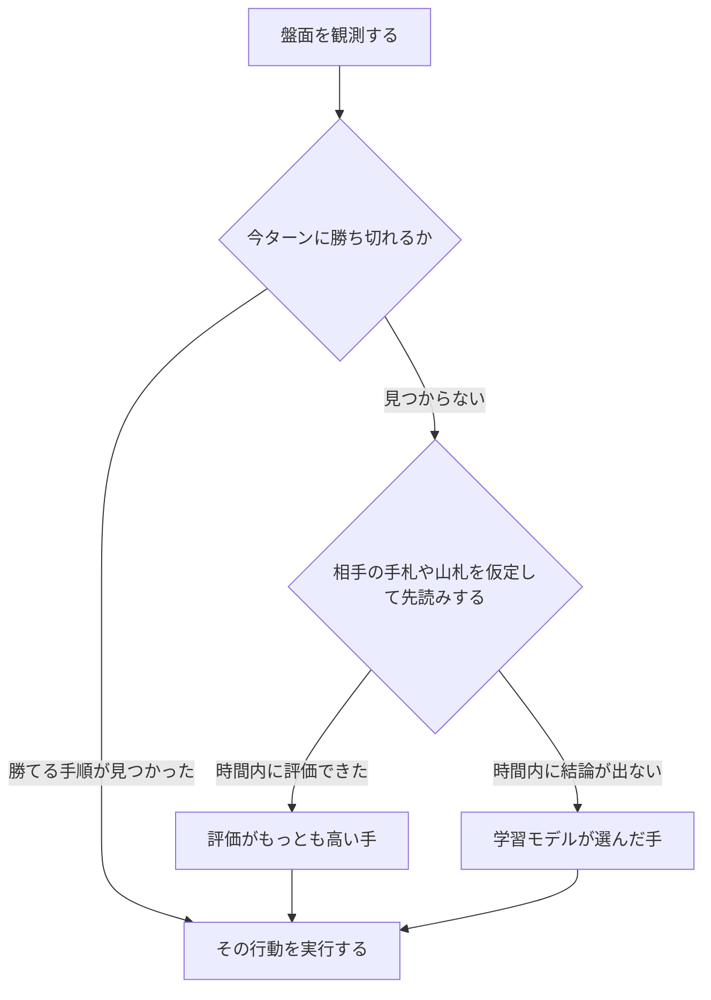

# Pokémon TCG AI Battle Challenge

大学の研究室の4人で、**ポケモンカードゲームを自律的にプレイする AI** を開発しました。[Pokémon Trading Card Game AI Battle Challenge](https://ptcg-abc.pokemon.co.jp/) 第一ラウンド・シミュレーション部門に参加し、Kaggle 上で他チームの AI と対戦した記録です。

**最終 365位 / 6,807チーム — 上位約5.4%、銅メダル。**

作ったのは AI 本体だけではありません。対戦記録から学習する仕組み、AI の判断を見返すビュアー、大量の対戦で改善を確かめる評価環境も自作しました。

大会の開催体制（[公式サイト](https://ptcg-abc.pokemon.co.jp/)）：

- **主催：** Kaggle、株式会社ポケモン（The Pokémon Company）
- **共催：** 株式会社松尾研究所、HEROZ株式会社
- **開催協力：** Google、Google Cloud、NVIDIA
- **参加した部門：** 第一ラウンド・シミュレーション部門（2026年6月16日〜8月17日）

[作ったもの](#作ったもの) · [工夫と検証](#工夫したことと検証で分かったこと) · [AIの仕組み](#aiの仕組み) · [メンバーと担当](#メンバーと担当) · [実装と起動方法](#実装と起動方法) · [大会結果と順位分析](docs/results.md)

## 作ったもの

| 成果物 | できること |
|---|---|
| **対戦 AI** | 盤面を読み、カードの使用や攻撃といった行動を自動で選ぶ。勝ち筋の探索・先読み・学習モデルを組み合わせて判断する |
| **学習・評価環境** | 上位プレイヤーの対戦記録を学習データにし、複数の AI を手元で対戦させて改善を比較する |
| **対戦ビュアー** | 対戦を1手ずつ再生し、AI が選んだ行動と候補を確認する。人間が AI と対戦する機能も備える |
| **カード参照・印刷ツール** | 配布されたカード PDF を整理・印刷し、紙のカードで戦い方を検証する |

対戦ビュアーでは、盤面と行動の記録を照らし合わせて AI の判断を調べられます。上の画面はカード画像を読み込まず、テキスト表示に切り替わった状態です。

## 工夫したことと検証で分かったこと

**見えない相手の情報を仮定して、先を読む。** 相手の手札や山札は見えません。ありうる中身を複数通り仮定し、それぞれで行動の結果をシミュレーションして、平均的に良い手を選ぶ仕組みを作りました。

**判断を見返せるようにして、改善につなげる。** 勝敗だけでは、どの判断に問題があったのか分かりません。そこで対戦記録を集め、行動の候補や相手デッキの推定をビュアーで確認できるようにしました。同じ記録は、上位プレイヤーの判断を学ぶ教師データにも使っています。

**多数の対戦で、変更の効果を確かめる。** 引くカードによって結果が変わるため、少数の勝敗では改善したかどうかを判断できません。終盤にデッキを変更したときは、AI の判断ロジックを固定したまま、当時多かった相手を再現した手元の評価環境で約1万試合を回し、勝率が **70.1% → 76.2%（+6.1ポイント）** に上がることを確かめてから採用しました（Kaggle 上の勝率とは別の、手元での数字です）。

一方で、相手デッキの予測を判断材料に加える、先読みを深くするといった施策では、勝率の改善を確認できませんでした。効果を確認できたものに絞って開発を進めています。

→ [開発の経緯と、うまくいかなかったこと](docs/development-story.md)

## AIの仕組み

最終エージェントは、当時の環境で多かった相手に有利なオーガポンデッキ（60枚のカード構成）と、3段構えの意思決定でできています。

1. **今すぐ勝てる手を探す（確定リーサル探索）** — このターンに相手を倒し切って勝てる手順があるかを調べ、見つかればそれを選びます。
2. **先を読む（PIMC）** — 見えていない相手の手札や山札を複数通り仮定し、それぞれで数手先まで読んで行動を評価します。
3. **学習した判断を使う（模倣学習）** — 上位プレイヤーが実際に選んだ手を学習したモデルが、先読みで時間内に結論が出ない場面を受け持ちます。

実装の入口は [`sample_submission/README.md`](sample_submission/README.md) です。対戦中の観測情報を受け取り、行動を返す `agent()` 関数から処理が始まります。

## チームでの進め方

研究室で「ハッカソンに出てみたい」「技術力を上げたい」という話が出ていたところに、このコンペを見つけたのが参加のきっかけです。週2回の勉強会で機械学習の知識と実験結果を共有し、次に試す方針を決めました。

どの手法が効くかは事前に分からないため、途中で進め方を変えています。各自が別々の手法を試して結果を持ち寄り、成果が出たものにチーム全体で集中する形にしました。配布 PDF からカードを印刷して実際にプレイしたことも、デッキの強さや動きを理解するのに役立っています。

## メンバーと担当

| メンバー | 主な担当 |
|---|---|
| [@Showgo1130](https://github.com/Showgo1130) | 対戦記録からの学習、モデルの組み込み、ビュアーと評価環境 |
| [@tsuoimorioka](https://github.com/tsuoimorioka) | 探索アルゴリズム、思考時間の制御、自己対戦による強化学習の試行 |
| [@koshincarrier-pixel](https://github.com/koshincarrier-pixel) | 条件分岐による行動判断、盤面の特徴量づくり、学習・評価 |
| [@inada107](https://github.com/inada107) | 勝ち切る手順の探索、学習モデルとの接続、デッキごとの戦術 |

→ [担当の詳細とチームの取り組み](docs/development-story.md#メンバーの担当詳細)

## 実装と起動方法

| 目的 | 入口 |
|---|---|
| AI の実装を読む | [提出エージェントの構成](sample_submission/README.md) · [入口のコード](sample_submission/main.py) |
| ビュアーを起動する・AI と対戦する | [ビュアーの使い方と起動手順](battle_review_viewer/README.md) |
| 検証コードを読む | [テストとローカル対戦の構成](sample_submission/tests/README.md) |
| カードを参照・印刷する | [カード参照ツール](cardlist_referenced/README.md) |

実行には Python 3.12 以上と、[Kaggle で配布されているコンペのデータ](https://www.kaggle.com/competitions/pokemon-tcg-ai-battle/data) が必要です。ファイルの配置や起動手順は、各ツールの README を参照してください。カード画像は配布 PDF から各自の環境で生成する方式のため、リポジトリには含めていません。

**公開状況：** 上の表のリンク先は、このリポジトリで公開している実装・手順です。リプレイの収集・学習データ生成を行う `kaggle_replays/` と、大量の対戦を回す `league/`・`opponents/` は、作業ブランチから master への統合を進めています。

## 開発記録を読む

- [開発の経緯とチームの取り組み](docs/development-story.md) — デッキと手法の変遷、うまくいかなかったこと、担当の詳細
- [大会結果と順位分析](docs/results.md) — 最終成績、評価途中の最高順位、対戦相手やスコアの変化
