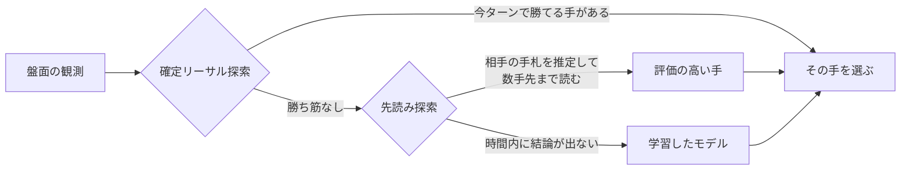
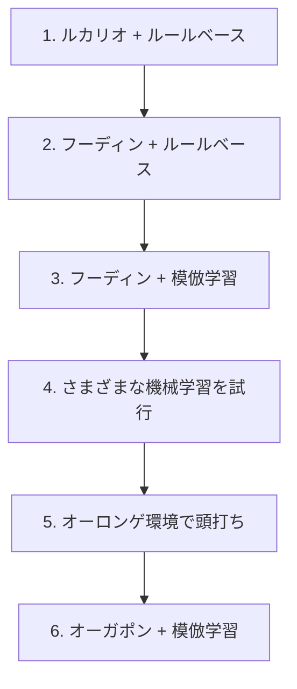

# Pokémon TCG AI Battle Challenge

株式会社ポケモン公式の [Pokémon Trading Card Game AI Battle Challenge](https://ptcg-abc.pokemon.co.jp/) に、大学の研究室のメンバー4人で参加した記録です。ポケモンカードゲームを自律的にプレイする AI エージェントを開発し、Kaggle 上で他チームと対戦させました。

**最終 365位 / 6,807チーム（銅メダル）。提出期限の2日前には31位（銀メダル圏）まで到達しました。**

- 開催: Kaggle（The Pokémon Company 主催）
- チーム: 4名
- 最終エージェント: オーガポンデッキ ＋ 3段構えの意思決定（今すぐ勝てる手を探す → 先読み → 学習したモデル）

## 参加の経緯

研究室で「ハッカソンに出てみたい」「技術力を上げたい」という話が出ていたところに、このコンペを見つけました。カードゲームの AI という題材が面白そうだったことと、時期が重なったことで参加を決めています。

## 結果

| | |
|---|---|
| 最終順位 | **365位 / 6,807チーム**（銅メダル） |
| 最高順位 | **31位**（銀メダル圏 / 2026年8月15日 — 提出期限の2日前） |

| 最高順位を記録したとき | 最終順位 |
|---|---|
|  |  |

### 順位が動いた理由

理由は2つあります。

#### 1. 提出期限のあとに、約2週間の「最終評価期間」がある

期限後もエージェント同士の対戦が続き、レーティングが落ち着いたところで最終順位が確定する、という公式のルールです。

| | |
|---|---|
| 提出期限 | 2026年8月17日 |
| 31位を記録した日 | 8月15日（期限の2日前。参加チームが出そろった最終盤です） |
| 最終順位の確定 | 期限から約2週間後 |

31位は、この評価期間に入る前の数字です。提出した直後は対戦数が少ないぶん、スコアが大きく振れます。

**31位に到達した時点で、この提出が終えていた対戦は18試合、成績は16勝2敗（89%）でした。** 提出してから1時間あまりの記録です。そのまま対戦が積み重なると、勝率はこう動きました。

| 消化した試合数 | 通算成績 | 勝率 |
|---|---|---:|
| 10試合 | 9勝 1敗 | 90% |
| **18試合** | **16勝 2敗** | **89%** ← このとき31位 |
| 25試合 | 19勝 6敗 | 76% |
| 35試合 | 25勝 10敗 | 71% |
| 50試合 | 30勝 20敗 | 60% |
| 67試合（この提出の最終） | 36勝 31敗 | **54%** |

もうひとつ、勝率が下がること自体は仕組み上あたりまえでもあります。このコンペのマッチングは**同じくらいのレーティングの相手と当たる**ようになっているため、順位が上がるほど対戦相手も強くなります。実際、当たった相手はこう変わっていました。

| 局面 | 戦績 | 当たった相手の平均順位 |
|---|---|---:|
| 1〜18試合（31位に到達した時点） | 16勝 2敗（89%） | 1029位 |
| 19〜35試合 | 9勝 8敗（53%） | 423位 |
| 36試合目以降 | 11勝 21敗（34%） | 303位 |

序盤は自分より下位の相手が多く、勝ち越したぶんレーティングが上がり、その結果として上位の相手と当たるようになります。勝率が5割へ近づいていくのは、この仕組みの上では自然な動きです。

つまり31位は、序盤に引きの良い試合が続いたぶんがそのままスコアに乗った状態でした。同じ提出のスコアを、内容を一切変えないまま17日間追いかけると、こう動きました。

| | スコア |
|---|---|
| 提出した日（8/15）の最高値 | **1100.1** ← このとき31位 |
| 2日後（8/17） | 約 966 |
| 4日後（8/19） | 約 906 |
| 2週間後（8/31） | 約 921 |
| 最終スコア | **920.4** ← 365位 |

1,100点台が出たのは提出した日だけで、17日間590回の記録のうち9%でした。それ以外の期間はずっと910〜920点です。

#### 2. 最終盤に環境が動き、得意にしていた相手が減った

最後に選んだオーガポンデッキは、当時もっとも多かったオーロンゲデッキに強い、という理由で採用したものです。2026年8月1日の時点では、スコア1000以上の層の**約6割がオーロンゲ**でした。

この読みはよく当たっていて、**Kaggle 上での実際の対戦**57試合の内訳はこうなっています。

| 相手のデッキ | 戦績 | 勝率 |
|---|---|---:|
| **オーロンゲ** | **16勝 2敗** | **89%** |
| フーディン | 6勝 6敗 | 50% |
| ルカリオ | 2勝 3敗 | 40% |
| その他 | 11勝 11敗 | 50% |
| **合計** | **35勝 22敗** | **61%** |

対戦の3分の1がオーロンゲで、そこをほぼ取り切っていました。裏を返すと、**オーロンゲを除いた成績は19勝20敗（49%）**です。総合成績のほとんどを、この1つの相性が支えていたことになります。

ところが期限が近づくと、オーロンゲを使っていたチームが別のデッキに乗り換え、オーガポンを使うチームも増えました。**得意にしていた相手が上位から減った**ため、最終評価期間のあいだに勝率が落ちていきました。

自分たちが何も変えなくても、他チームの選択で成績が変わる。環境を読んでデッキを選ぶ判断は、当たれば大きい代わりに、環境が動けばその分がそのまま失われる。これが最後に得た教訓です。

#### 測ることの難しさ

この「提出を変えていないのにスコアが動く」性質は、開発中もっとも困った点でした。手元で改善しても、それが順位に効いたのかを提出1回の結果からは判断できません。そこで提出ごとのスコアを記録し続け、どれくらい振れるのかを自分たちで測りました（`kaggle_replays/_lb_history.tsv`）。追跡した提出では、振れ幅は中央値で173点ありました。

## このコンペの何が難しいのか

一般的な機械学習コンペとは、難しさの種類が違いました。

**相手の情報が見えない。** 相手の手札・山札・サイドは非公開です。見えている盤面から相手の持ち物を推定しながら意思決定する必要があります。

**1試合の結果に運の影響が大きい。** 引いたカード次第で勝敗が変わるため、勝率が上がったのか、たまたま勝てただけなのかの区別が難しくなります。手元の検証で1〜2%の勝率差を見分けるだけでも、数千試合を回す必要がありました。

**フィードバックが遅い。** 提出は1日5回までです。しかも上記のとおり、提出しても本当のスコアが分かるまでに時間がかかります。

**環境が動く。** 他チームが使うデッキの分布は日々変わります。自分たちが何も変えていなくても、流行のデッキが変われば勝率が変わります。実際、この「環境の変化」が終盤の方針転換の理由になりました。

## 最終的に作ったもの

オーガポンデッキと、3段構えの意思決定パイプラインです。



- **今すぐ勝てる手を探す** — このターンに相手を倒し切って勝てる手順があるかを、しらみつぶしに調べます。見つかればそれ以上考える必要がありません
- **先読み探索** — 見えていない相手の手札や山札を「たぶんこうだろう」と何通りも仮定し、それぞれで数手先まで読んで、平均的に良い手を選びます（PIMC と呼ばれる手法です）
- **学習したモデル** — 上位プレイヤーの対戦記録から「その盤面で実際に選ばれた手」を学習させたものです（模倣学習）。先読みが時間内に終わらない場面を受け持ちます

エージェント本体は [`sample_submission/`](sample_submission/) にあります。

## そこに至るまで

デッキとアルゴリズムの両方を、交互に見直しながら進めました。



**1. ルカリオデッキ ＋ ルールベース**
まず動くものを作ることを優先しました。扱いやすいルカリオデッキを選び、条件分岐で行動を決めるエージェントを実装しています。

**2. フーディンデッキ ＋ ルールベース**
環境で流行っていたこと、手札を増やしながら戦う動きが強いと判断したことから、デッキをフーディンに変更しました。ルールベースのまま、このデッキの動きに合わせて作り直しています。

**3. フーディンデッキ ＋ 模倣学習**
ルールベースは、書いたぶんしか強くなりません。上位プレイヤーのリプレイから「その盤面で実際に選ばれた手」を教師として学習させれば、自分たちが言語化できていない判断も獲得できるのではないか、という仮説で模倣学習に移行しました。

**4. さまざまな機械学習の試行**
盤面の有利不利を点数で見積もるモデル（バリューネットワーク）、強化学習、先読みとの組み合わせなどを試しました。ここは分量があるため別ページに分けます（現在まとめ中）。

**5. オーロンゲ環境で頭打ち**
フーディンに強いオーロンゲデッキが流行し始めました。AI の判断ロジックや先読みを改善してこの対面を取りに行こうとしましたが、手元の評価では勝率が上がりませんでした。**デッキ相性の差はプレイングでは埋めきれない**、というのがこの段階での結論です。

**6. オーガポンデッキ ＋ 模倣学習**
オーロンゲに強いオーガポンデッキへ乗り換えました。AI 側は一切変えず、デッキだけを差し替えて、環境に多いデッキを再現した相手と**手元で約1万試合**を回し、勝率が 70.1% → 76.2% に上がることを確かめてから採用しました（これは手元の評価環境での数字で、Kaggle 上の勝率とは別のものです）。

この一連で分かったのは、**効いたのはデッキの選択であり、アルゴリズムの改良ではなかった**ということです。手元の実験でも、デッキを変えたときの差ははっきり出た一方、AI 側の改良による差は、ほとんどが試合ごとの運のばらつきに埋もれてしまいました。

## うまくいかなかったこと

試して駄目だったものも記録しています。

**相手のデッキ予測を AI に渡す。** 見えているカードから相手のデッキタイプを推定するモデルを作り、推定の精度自体は出ました。しかしその予測を判断材料として渡しても、手元の評価では勝率が改善しませんでした。盤面の情報にすでに相手の情報が反映されており、冗長だったと考えています。

**長期的な計画・深い先読み。** 探索を深く、広くしても、手元の評価では勝率が改善しませんでした。1手あたりの時間には上限があるため、深さを増やすと試行回数が減り、差し引きで得をしませんでした。

**Transformer を使ったモデル。** 盤面を文章のような並びとして扱うモデルを試しましたが、それまでのモデルを超えられませんでした。

いずれも、勝率が上がらなかったこと自体より、**上がっていないと判定できる評価方法を用意していたこと**が成果だったと考えています。

## チームでの進め方

**紙で回してデッキを選んだ。** 最初にやるべきは、どのデッキが強いのかを知ることでした。配布されたカードPDFから実物を印刷するツールを作り、実際に紙のポケモンカードでプレイして確かめています。

**見えないものを見えるようにした。** Kaggle 上では対戦画面しか確認できず、提出も1日5回までです。デッキが意図どおり動いているか、相手デッキの推定が盤面ごとに機能しているかを確認できないため、リプレイを1手ずつ再生できるバトルビュアーを自作しました。

**週2回の勉強会。** 全員が機械学習に詳しくなかったため、勉強会を開きました。各自が読んできた本の内容をスライドで共有し、あわせて進捗の確認と次の方針決めも行っています。

**分担のやり方を途中で変えた。** プロダクト開発なら機能ごとに分担できますが、性能を上げることが目的の場合それが成立しないことに気付きました。どの手法が効くか事前に分からないためです。そこで、各自が別々の手法を試して結果を共有し、成果が出たものにチームで集中する形に切り替えました。力を入れる場所を絞れるようになり、効率が上がっています。

## 作ったツール

提出物とは別に、開発を進めるための道具を作っています。

| ツール | 目的 |
|---|---|
| [`cardlist_referenced/`](cardlist_referenced/) | 配布カードPDFの参照・整理・印刷。紙でデッキを回して検証するために作った |
| [`battle_review_viewer/`](battle_review_viewer/) | 対戦リプレイを1手ずつ再生できるビュアー。盤面・選択肢・ログ・相手デッキの推定を確認できる。人間 vs CPU で対戦する機能もある |
| `kaggle_replays/` | Kaggle 上の対戦リプレイの取得・分析。上位プレイヤーの手を模倣学習の教師データにするためにも使っている |
| `league/` · `opponents/` | ローカルで多数のエージェントを総当たりさせる対戦環境 |


バトルビュアーの画面です。1手ずつ盤面を再生し、HP・エネルギー・サイド・山札の残数、そのターンに発動した効果、エージェントが選んだ行動とその候補を確認できます。

カード画像は、コンペが提供する PDF から各自の環境でローカル生成する方式にしており、リポジトリには含めていません（`.gitignore` 済み）。上の画面もカード画像を読み込んでいない状態で、カードはテキスト表示にフォールバックしています。

## メンバーと担当

4人チームです。

| メンバー | 役割 | 代表的な担当 |
|---|---|---|
| [@Showgo1130](https://github.com/Showgo1130) | 機械学習と、開発・評価の基盤 | 模倣学習のパイプライン、対戦ビュアー |
| [@tsuoimorioka](https://github.com/tsuoimorioka) | 探索と強化学習 | 強化学習の学習器、モンテカルロ探索 |
| [@koshincarrier-pixel](https://github.com/koshincarrier-pixel) | ルールベース AI と学習の実験基盤 | 行動を決める条件分岐の中核、Kaggle 上での学習実行 |
| [@inada107](https://github.com/inada107) | 確定リーサル探索とデッキ戦術 | 勝ち切る手順を証明する探索、デッキごとの方針 |

<details>
<summary><b>担当の内訳（クリックで開く）</b></summary>

#### [@Showgo1130](https://github.com/Showgo1130) — 機械学習と、開発・評価の基盤

- 対戦を1手ずつ見返すバトルビュアーと、配布 PDF から紙のデッキを刷るツール
- Kaggle のリプレイを集めて学習データにする仕組み
- 上位プレイヤーの手を学習させるパイプライン（特徴量づくり・学習・評価）
- 学習したモデルを提出エージェントに載せ、勝ち切る手の探索と組み合わせる実装
- 勝率を予測するモデルと、相手が何のデッキかの判別（条件分岐版と機械学習版）
- 相手の手札・山札の推定と、それを使った先読み
- エージェント同士を総当たりさせるリーグと、学習用の対戦データ収集
- 環境にどのデッキが何割いるかの調査と、デッキ候補を多段階で絞り込む仕組み
- 改善が本物かを判定する A/B 評価、必要な試合数の見積もり、提出スコアの継続記録
- テストの整備と、各部品を1本の意思決定につなぐ統合

#### [@tsuoimorioka](https://github.com/tsuoimorioka) — 探索と強化学習

- 強化学習の学習器（PPO）と、Transformer を使った手の選び方
- 学習を Kaggle や複数マシンで回す仕組み
- 試行をくり返して手を評価するモンテカルロ探索
- 勝ち切れる手順を探す探索の最初の実装
- 1手にかける時間の配分制御
- 特定の相手に特化した戦略の組み立てと、その効果検証
- 練習相手になるルールベースのエージェント
- 使用デッキの構成更新（ドラパルト、アラカザム）
- 提出エージェントの入口と、初期の対戦ビュアー

#### [@koshincarrier-pixel](https://github.com/koshincarrier-pixel) — ルールベース AI と学習の実験基盤

- 条件分岐で行動を決めるエージェントの中核部分
- エネルギーを誰に付けるか・いつ「にげる」かの判断
- Kaggle 上で学習と評価を回す仕組み
- モデルの再学習と、前のモデルとの比較検証
- 盤面をモデルに渡すときの表し方（手札の中身・先攻後攻など）の改良
- 学習データを増やすとどこまで伸びるかの測定
- 間違えた手の内訳を調べる仕組みと、強化学習がうまくいかない原因の切り分け
- 相手のデッキに応じた処理の切り替え
- リプレイを高速に取得するツール

#### [@inada107](https://github.com/inada107) — 確定リーサル探索とデッキ戦術

- 勝ち筋を証明して勝ち切る手順を出す確定リーサル探索の本体
- 「にげる」判断への、ベイズ推定による相手の攻撃成功率の導入
- デッキごとの方針とカード別プロファイルの実装
- 特定デッキ専用のルールベースエージェント
- 相手デッキの予測を行動の優先度に反映させる配線
- 開発用のツール類とテストの整備
- 提出まわりの設定切り替え

</details>

> ブランチとコミットの実績から整理したものです。本人しか把握していない作業は拾えていない可能性があります。また master に統合していない作業ブランチがあり、統合後に見直す予定です。

## リポジトリ構成

```
pokemon-tcg-ai-battle/
├── sample_submission/      # 提出するエージェント本体
│   ├── main.py             #   エントリポイント。agent(obs) を実装する
│   ├── deck.csv            #   使用デッキ（カードID 60枚）
│   ├── ptcg_ai/            #   探索・学習モデル・推論の実装
│   ├── configs/            #   エージェント構成の切り替え
│   └── models/             #   提出時の構成を凍結したもの
├── kaggle_replays/         # リプレイ取得・分析・学習データ生成
├── battle_review_viewer/   # リプレイビュアー
├── cardlist_referenced/    # カード参照・印刷ツール
├── league/ · opponents/    # ローカル対戦環境
└── data/                   # コンペ提供データ（Kaggle からダウンロードして配置）
```

一部のディレクトリ（`kaggle_replays/` `league/` `opponents/` など、分析・評価まわりのコード）は現在それぞれの作業ブランチにあり、master への統合を進めています。

`data/` はサイズが大きいためリポジトリに含めていません。[コンペのデータページ](https://www.kaggle.com/competitions/pokemon-tcg-ai-battle/data)から取得して配置してください。

エージェントの構成や過去の実験の詳細は、各フォルダの README と [`sample_submission/docs/`](sample_submission/docs/) にあります。
