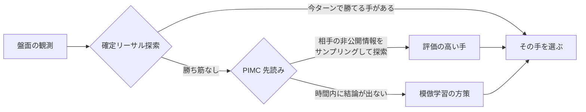
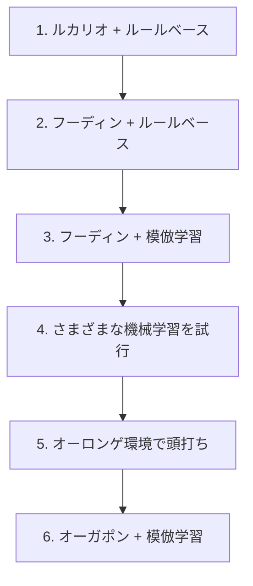

# Pokémon TCG AI Battle Challenge

株式会社ポケモン公式の [Pokémon Trading Card Game AI Battle Challenge](https://ptcg-abc.pokemon.co.jp/) に、大学の研究室のメンバー4人で参加した記録です。ポケモンカードゲームを自律的にプレイする AI エージェントを開発し、Kaggle 上で他チームと対戦させました。

**最終 365位 / 6,807チーム（銅メダル）。期間中の最高順位は31位。**

- 開催: Kaggle（The Pokémon Company 主催）
- チーム: 4名
- 最終エージェント: オーガポンデッキ ＋ リーサル探索・PIMC 先読み・模倣学習の方策を組み合わせた意思決定パイプライン

## 参加の経緯

研究室で「ハッカソンに出てみたい」「技術力を上げたい」という話が出ていたところに、このコンペを見つけました。カードゲームの AI という題材が面白そうだったことと、時期が重なったことで参加を決めています。

## 結果

| | |
|---|---|
| 最終順位 | **365位 / 6,807チーム**（銅メダル）スコア 920.4 |
| 最高順位 | **31位** スコア 1100.1（2026-08-15） |

| 最高順位 | 最終順位 |
|---|---|
|  |  |

### 順位の読み方

このコンペのスコアは、提出したエージェントが対戦を続けることで更新され続けるレーティングです。**提出物を一切変更していなくても、スコアは大きく動きます。**

31位を記録した提出（`ref=55527580`）を、提出後17日間・590回にわたって記録した推移です。

| 日付 | 観測回数 | 最小 | 中央値 | 最大 |
|---|---:|---:|---:|---:|
| 08-15（提出当日） | 39 | 692.3 | 1040.9 | **1100.1** |
| 08-16 | 67 | 948.0 | 976.5 | 1031.5 |
| 08-17 | 47 | 954.7 | 966.2 | 980.7 |
| 08-19 | 68 | 891.8 | 905.7 | 917.6 |
| 08-31（最終観測） | 82 | 898.9 | 920.8 | 938.8 |

1000点を超えたのは 590回中53回（9.0%）で、そのすべてが提出当日でした。全期間の中央値は 911.0、最終観測値は 916.2 です。最終スコア 920.4 はこの水準とほぼ一致します。

つまり **31位はレーティングが収束する前の上振れ**であり、このエージェントの実力値は一貫して910〜920点付近でした。同一提出のスコア振れ幅は、追跡した提出全体の中央値で 173.8点あります。

この「変えていないのにスコアが動く」性質は、開発中にもっとも苦しんだ点でもあります。ローカルで改善が出ても、それが順位に効いたのかを1回の提出結果からは判断できません。そのため提出ごとのスコアを継続的に記録し、変動幅そのものを実測しました（[`kaggle_replays/_lb_history.tsv`](kaggle_replays/_lb_history.tsv)）。

## このコンペの何が難しいのか

一般的な機械学習コンペとは、難しさの種類が違いました。

**相手の情報が見えない。** 相手の手札・山札・サイドは非公開です。見えている盤面から相手の持ち物を推定しながら意思決定する必要があります。

**1試合の結果に運の影響が大きい。** 引いたカード次第で勝敗が変わるため、勝率が上がったのか、たまたま勝てただけなのかの区別が難しくなります。ローカル評価で±2ptの差を有意に判定するには数千試合が必要でした。

**フィードバックが遅い。** 提出は1日5回までです。しかも上記のとおり、提出しても本当のスコアが分かるまでに時間がかかります。

**環境が動く。** 他チームが使うデッキの分布は日々変わります。自分たちが何も変えていなくても、流行のデッキが変われば勝率が変わります。実際、この「環境の変化」が終盤の方針転換の理由になりました。

## 最終的に作ったもの

オーガポンデッキと、3段構えの意思決定パイプラインです。



- **確定リーサル探索** — このターンに相手を倒し切って勝てる手順があるかを探索します。あるなら他を考える必要がありません
- **PIMC 先読み** — 相手の手札や山札を確率的に仮定（決定化）したうえで先を読み、平均的に良い手を選びます
- **模倣学習の方策** — 上位プレイヤーのリプレイから「その盤面で実際に選ばれた手」を学習したモデルです。探索が間に合わない場面を受け持ちます

エージェント本体は [`sample_submission/`](sample_submission/) にあります。

## そこに至るまで

デッキとアルゴリズムの両方を、交互に見直しながら進めました。



**1. ルカリオデッキ ＋ ルールベース**
まず動くものを作ることを優先しました。扱いやすいルカリオデッキを選び、条件分岐で行動を決めるエージェントを実装しています。

**2. フーディンデッキ ＋ ルールベース**
環境で流行っていたこと、手札を増やしながら戦う動きが強いと判断したことから、デッキをフーディンに変更しました。ルールベースのまま、このデッキの動きに合わせて作り直しています。

**3. フーディンデッキ ＋ 模倣学習**
ルールベースは、書いたぶんしか強くなりません。上位プレイヤーのリプレイから「その盤面で実際に選ばれた手」を教師として学習させれば、自分たちが言語化できていない判断も獲得できるのではないか、という仮説で模倣学習に移行しました。

**4. さまざまな機械学習の試行**
バリューネットワーク、強化学習、探索との組み合わせなどを試しました。ここは分量があるため別ページに分けます（現在まとめ中）。

**5. オーロンゲ環境で頭打ち**
フーディンに強いオーロンゲデッキが流行し始めました。方策や探索を改善してこの対面を取りに行こうとしましたが、勝率は上がりませんでした。**デッキ相性の差はプレイングでは埋めきれない**、というのがこの段階での結論です。

**6. オーガポンデッキ ＋ 模倣学習**
オーロンゲに強いオーガポンデッキへ乗り換えました。方策は据え置き、デッキだけを差し替えた比較で効果を確認してから採用しています（9,990試合のホールドアウトで勝率 0.701 → 0.762、+6.11pt / 95%信頼区間 [+4.88, +7.33]）。

この一連で分かったのは、**効いたのはデッキの選択であり、アルゴリズムの改良ではなかった**ということです。手元の実験でも、デッキ変更による差は明確に検出できた一方、方策の改良による差は多くがノイズに埋もれていました。

## うまくいかなかったこと

試して駄目だったものも記録しています。

**相手デッキの予測を方策に渡す。** 見えているカードから相手のデッキタイプを推定するモデルを作り、推定の精度自体は出ました。しかしその予測を方策の入力に加えても、勝率は改善しませんでした。盤面の情報にすでに相手の情報が反映されており、冗長だったと考えています。

**長期的な計画・深い先読み。** 探索を深く、広くしても勝率は改善しませんでした。1手あたりの時間には上限があるため、深さを増やすと試行回数が減り、差し引きで得をしませんでした。

**Transformer による方策。** 盤面を系列として扱うモデルを試しましたが、既存の方策を超えられませんでした。

いずれも、勝率が上がらなかったこと自体より、**上がっていないと判定できる評価方法を用意していたこと**が成果だったと考えています。

## チームでの進め方

**紙で回してデッキを選んだ。** 最初にやるべきは、どのデッキが強いのかを知ることでした。配布されたカードPDFから実物を印刷するツールを作り、実際に紙のポケモンカードでプレイして確かめています。

**見えないものを見えるようにした。** Kaggle 上では対戦画面しか確認できず、提出も1日5回までです。デッキが意図どおり動いているか、相手デッキの推定が盤面ごとに機能しているかを確認できないため、リプレイを1手ずつ再生できるバトルビュアーを自作しました。

**週2回の勉強会。** 全員が機械学習に詳しくなかったため、勉強会を開きました。各自が読んできた本の内容をスライドで共有し、あわせて進捗の確認と次の方針決めも行っています。

**分担のやり方を途中で変えた。** プロダクト開発なら機能ごとに分担できますが、性能を上げることが目的の場合それが成立しないことに気付きました。どの手法が効くか事前に分からないためです。そこで、各自が別々の手法を試して結果を共有し、成果が出たものにチームで集中する形に切り替えました。力を入れる場所を絞れるようになり、効率が上がっています。

## 作ったツール

提出物とは別に、開発を進めるための道具を作っています。

| ツール | 目的 |
|---|---|
| [`cardlist_referenced/`](cardlist_referenced/) | 配布カードPDFの参照・整理・印刷。紙でデッキを回して検証するために作った |
| [`battle_review_viewer/`](battle_review_viewer/) | 対戦リプレイを1手ずつ再生できるビュアー。盤面・選択肢・ログ・相手デッキの推定を確認できる。人間 vs CPU で対戦する機能もある |
| [`kaggle_replays/`](kaggle_replays/) | Kaggle 上の対戦リプレイの取得・分析。上位プレイヤーの手を模倣学習の教師データにするためにも使っている |
| [`league/`](league/) · [`opponents/`](opponents/) | ローカルで多数のエージェントを総当たりさせる対戦環境 |

## メンバーと担当

4人チームです。以下はブランチとコミットから整理した、各メンバーが主に取り組んでいた領域です。最終提出に反映されていない試行も含みます。

| メンバー | 主に取り組んだ領域 |
|---|---|
| [@Showgo1130](https://github.com/Showgo1130) | バトルビュアー / カードPDF編集・印刷ツール / 隠れ情報の推定と PIMC / 相手デッキ予測（ルール・機械学習の両方） / バリューネットワーク / 意思決定パイプラインの統合 / 模倣学習データの更新 |
| [@tsuoimorioka](https://github.com/tsuoimorioka) | リーサル探索 / モンテカルロ探索エージェント / 探索時間の動的管理 / PPO・分散セルフプレイ / デッキ実装 |
| [@koshincarrier-pixel](https://github.com/koshincarrier-pixel) | ルールベースAIの本体 / デッキプラン基盤 / エネルギー付与・にげるの判定ロジック / 模倣学習の再学習 / 相手別ルーティング |
| [@inada107](https://github.com/inada107) | デッキ方針の実装 / コンボ処理 / リーサル / PolicyModel / 相手デッキ予測 / 提出まわり |

> この表は暫定です。各メンバーの作業ブランチには master に統合していないものがあり、統合後に見直す予定です。

## リポジトリの歩き方

```
pokemon-tcg-ai-battle/
├── sample_submission/      # 提出するエージェント本体
│   ├── main.py             #   エントリポイント。agent(obs) を実装する
│   ├── deck.csv            #   使用デッキ（カードID 60枚）
│   ├── ptcg_ai/            #   探索・方策・推論の実装
│   ├── configs/            #   エージェント構成の切り替え
│   └── models/             #   提出時の構成を凍結したもの
├── kaggle_replays/         # リプレイ取得・分析・学習データ生成
├── battle_review_viewer/   # リプレイビュアー
├── cardlist_referenced/    # カード参照・印刷ツール
├── league/ · opponents/    # ローカル対戦環境
└── data/                   # コンペ提供データ（Kaggle からダウンロードして配置）
```

`data/` はサイズが大きいためリポジトリに含めていません。[コンペのデータページ](https://www.kaggle.com/competitions/pokemon-tcg-ai-battle/data)から取得して配置してください。

エージェントの構成や過去の実験の詳細は、各フォルダの README と [`sample_submission/docs/`](sample_submission/docs/) にあります。
