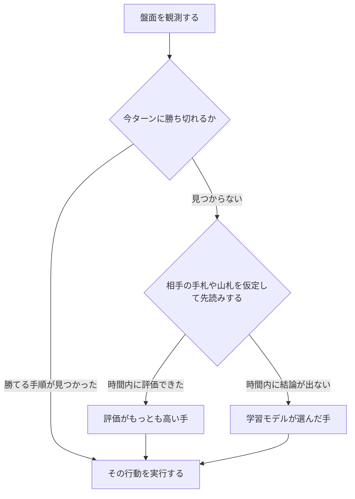
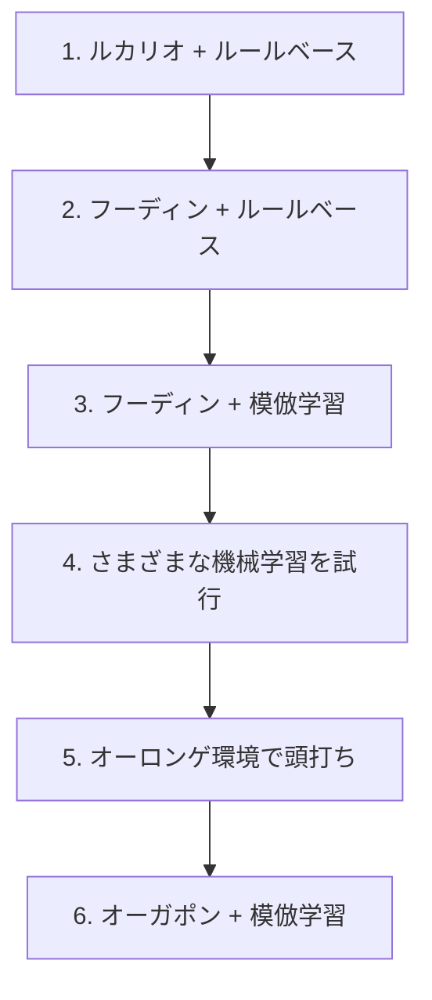

# Pokémon TCG AI Battle Challenge

大学の研究室の4人で、**ポケモンカードゲームを自律的にプレイする AI** を開発しました。[Pokémon Trading Card Game AI Battle Challenge](https://ptcg-abc.pokemon.co.jp/) 第一ラウンド・シミュレーション部門（2026年6月16日〜8月17日）に参加し、Kaggle 上で他チームの AI と対戦した記録です。

**最終 365位 / 6,807チーム — 上位約5.4%、銅メダル。提出期限の2日前には、31位（銀メダル圏）まで到達しました。**

| 提出期限2日前に到達した最高順位 | 最終順位 |
|---|---|
|  |  |

31位は、参加チームが出そろった最終盤での記録です。この大会のスコアは対戦が続くかぎり動き続けるレーティングで、提出期限のあとも約2週間の最終評価を経て順位が確定します。同じ提出のスコアを590回記録して、どこまでが実力でどこからが上振れかも自分たちで測りました。

→ [大会結果と順位分析](docs/results.md)

作ったのは AI 本体だけではありません。対戦記録から学習する仕組み、AI の判断を見返すビュアー、大量の対戦で改善を確かめる評価環境も自作しました。

主催: Kaggle・株式会社ポケモン｜共催: 株式会社松尾研究所・HEROZ株式会社｜開催協力: Google・Google Cloud・NVIDIA（[公式サイト](https://ptcg-abc.pokemon.co.jp/)）

[作ったもの](#作ったもの) · [コンペの難しさ](#このコンペの何が難しいのか) · [AIの仕組み](#aiの仕組み) · [そこに至るまで](#そこに至るまで) · [メンバーと担当](#メンバーと担当) · [コードの入口](#コードの入口)

## 作ったもの

| 成果物 | できること |
|---|---|
| **対戦 AI** | 盤面を読み、カードの使用や攻撃といった行動を自動で選ぶ。勝ち筋の探索・先読み・学習モデルを組み合わせて判断する |
| **学習・評価環境** | 上位プレイヤーの対戦記録を学習データにし、複数の AI を手元で対戦させて改善を比較する |
| **対戦ビュアー** | 対戦を1手ずつ再生し、AI が選んだ行動と候補を確認する。人間が AI と対戦する機能も備える |
| **カード参照・印刷ツール** | 配布されたカード PDF を整理・印刷し、紙のカードで戦い方を検証する |

対戦ビュアーでは、盤面と行動の記録を照らし合わせて AI の判断を調べられます。上の画面はカード画像を読み込まず、テキスト表示に切り替わった状態です。

## このコンペの何が難しいのか

一般的な機械学習コンペとは、難しさの種類が違いました。

**相手の情報が見えない。** 相手の手札・山札・サイドは非公開です。見えている盤面から相手の持ち物を推定しながら、意思決定する必要があります。

**1試合の結果に運の影響が大きい。** 引いたカード次第で勝敗が変わるため、勝率が上がったのか、たまたま勝てただけなのかの区別が難しくなります。手元の検証で1〜2%の勝率差を見分けるだけでも、数千試合を回す必要がありました。

**フィードバックが遅い。** 提出は1日5回までです。しかも提出しても、スコアが落ち着くまでに時間がかかります。そこで提出ごとのスコアを記録し続け、どれくらい振れるのかを自分たちで測りました（追跡した提出では、振れ幅は中央値で173点ありました）。

**環境が動く。** 他チームが使うデッキの分布は日々変わります。自分たちが何も変えていなくても、流行のデッキが変われば勝率が変わります。実際、この「環境の変化」が終盤の方針転換の理由になりました。

## AIの仕組み

最終エージェントは、当時の環境で多かった相手に有利なオーガポンデッキ（60枚のカード構成）と、3段構えの意思決定でできています。

1. **今すぐ勝てる手を探す（確定リーサル探索）** — このターンに相手を倒し切って勝てる手順があるかを調べ、見つかればそれを選びます。
2. **先を読む（PIMC）** — 見えていない相手の手札や山札を複数通り仮定し、それぞれで数手先まで読んで行動を評価します。
3. **学習した判断を使う（模倣学習）** — 上位プレイヤーが実際に選んだ手を学習したモデルが、先読みで時間内に結論が出ない場面を受け持ちます。

実装の入口は [`sample_submission/README.md`](sample_submission/README.md) です。対戦中の観測情報を受け取り、行動を返す `agent()` 関数から処理が始まります。

## そこに至るまで

この形にたどり着くまでに、デッキとアルゴリズムの両方を交互に見直しています。

最後のデッキ変更では、AI 側を一切変えずにデッキだけを差し替え、当時多かった相手を再現した手元の評価環境で約1万試合を回しました。勝率が **70.1% → 76.2%（+6.1ポイント）** に上がることを確かめてから採用しています（Kaggle 上の勝率とは別の、手元での数字です）。

<b>各段階で何をして、何が分かったか（クリックで開く）</b>

**1. ルカリオデッキ ＋ ルールベース** — まず動くものを作ることを優先しました。扱いやすいルカリオデッキを選び、条件分岐で行動を決めるエージェントを実装しています。

**2. フーディンデッキ ＋ ルールベース** — 環境で流行っていたこと、手札を増やしながら戦う動きが強いと判断したことから、デッキをフーディンに変更しました。ルールベースのまま、このデッキの動きに合わせて作り直しています。

**3. フーディンデッキ ＋ 模倣学習** — ルールベースは、書いたぶんしか強くなりません。上位プレイヤーのリプレイから「その盤面で実際に選ばれた手」を教師として学習させれば、自分たちが言語化できていない判断も獲得できるのではないか、という仮説で模倣学習に移行しました。

**4. さまざまな機械学習の試行** — 盤面の有利不利を点数で見積もるモデル（バリューネットワーク）、強化学習、先読みとの組み合わせなどを試しました。

**5. オーロンゲ環境で頭打ち** — フーディンに強いオーロンゲデッキが流行し始めました。AI の判断ロジックや先読みを改善してこの対面を取りに行こうとしましたが、手元の評価では勝率が上がりません。**デッキ相性の差はプレイングでは埋めきれない**、というのがこの段階での結論です。

**6. オーガポンデッキ ＋ 模倣学習** — オーロンゲに強いオーガポンデッキへ乗り換えました。上に書いた約1万試合の比較で効果を確かめてから採用しています。

この一連ではっきり効果を確認できたのは、デッキの変更でした。デッキを変えたときの差は手元の評価でも明確に出た一方、AI 側の改良による差は、ほとんどが試合ごとの運のばらつきに埋もれています。

## うまくいかなかったこと

効果が出なかった施策も残しています。

**相手のデッキ予測を AI に渡す。** 見えているカードから相手のデッキタイプを推定するモデルを作り、推定の精度自体は出ました。しかしその予測を判断材料として渡しても、手元の評価では勝率が改善しませんでした。盤面の情報にすでに相手の情報が反映されており、冗長だったと考えています。

**長期的な計画・深い先読み。** 探索を深く、広くしても、手元の評価では勝率が改善しませんでした。1手あたりの時間には上限があるため、深さを増やすと試行回数が減り、差し引きで得をしませんでした。

**Transformer を使ったモデル。** 盤面を文章のような並びとして扱うモデルを試しましたが、それまでのモデルを超えられませんでした。

いずれも、勝率が上がらなかったこと自体より、**上がっていないと判定できる評価方法を用意していたこと**が成果だったと考えています。

## チームでの進め方

研究室で「ハッカソンに出てみたい」「技術力を上げたい」という話が出ていたところに、このコンペを見つけたのが参加のきっかけです。

**紙で回してデッキを選んだ。** 最初にやるべきは、どのデッキが強いのかを知ることでした。配布されたカード PDF から実物を印刷するツールを作り、実際に紙のポケモンカードでプレイして確かめています。

**見えないものを見えるようにした。** Kaggle 上では対戦画面しか確認できません。デッキが意図どおり動いているか、相手デッキの推定が盤面ごとに機能しているかを確かめられないため、リプレイを1手ずつ再生できるバトルビュアーを自作しました。

**週2回の勉強会。** 全員が機械学習に詳しくなかったため、勉強会を開きました。各自が読んできた本の内容をスライドで共有し、あわせて進捗の確認と次の方針決めも行っています。

**分担のやり方を途中で変えた。** どの手法が効くかは事前に分からず、機能ごとに担当を固定するやり方では進みませんでした。そこで、各自が別々の手法を試して結果を持ち寄り、成果が出たものにチーム全体で集中する形に切り替えています。

**判断の基準をルールにして共有した。** AI の構成はブランチではなく config で切り替える、常に提出できる安定版を残す、強さは感覚ではなく勝率と実験記録で判断する — こうした取り決めを [チーム開発ルール](docs/team-development-rules.md) にまとめ、4人で守っていました。

## メンバーと担当

| メンバー | 主な担当 |
|---|---|
| [@Showgo1130](https://github.com/Showgo1130) | 対戦記録からの学習、モデルの組み込み、ビュアーと評価環境 |
| [@tsuoimorioka](https://github.com/tsuoimorioka) | 探索アルゴリズム、思考時間の制御、自己対戦による強化学習の試行 |
| [@koshincarrier-pixel](https://github.com/koshincarrier-pixel) | 条件分岐による行動判断、盤面の特徴量づくり、学習・評価 |
| [@inada107](https://github.com/inada107) | 勝ち切る手順の探索、学習モデルとの接続、デッキごとの戦術 |

→ [担当の詳細とチームの取り組み](docs/development-story.md#メンバーの担当詳細)

## コードの入口

| 見たいもの | 場所 |
|---|---|
| 提出した AI の実装 | [提出エージェントの構成](sample_submission/README.md) · [`agent()` のコード](sample_submission/main.py) |
| 対戦ビュアー | [battle_review_viewer/](battle_review_viewer/README.md) |
| 学習・評価環境 | [リプレイ収集と学習データ生成](kaggle_replays/README.md) · [総当たり対戦のリーグ](league/README.md) |
| 検証コード | [テストとローカル対戦の構成](sample_submission/tests/README.md) |
| カード参照・印刷ツール | [cardlist_referenced/](cardlist_referenced/README.md) |

動かすのに必要な環境（Python 3.12 以上と [Kaggle 配布のコンペデータ](https://www.kaggle.com/competitions/pokemon-tcg-ai-battle/data)）と手順は、各ディレクトリの README にまとめています。カード画像は配布 PDF から各自の環境で生成する方式のため、リポジトリには含めていません。

提出したモデルは、使用デッキ・設定・重みのハッシュと、採用を決めた評価の根拠をあわせて [`sample_submission/models/`](sample_submission/models/) に凍結してあります。

## もっと詳しく

- [開発の経緯とチームの取り組み](docs/development-story.md) — 各段階の背景と、メンバー4人それぞれの担当の内訳
- [大会結果と順位分析](docs/results.md) — 最終成績、31位が上振れだったことの検証、対戦相手とスコアの変化
