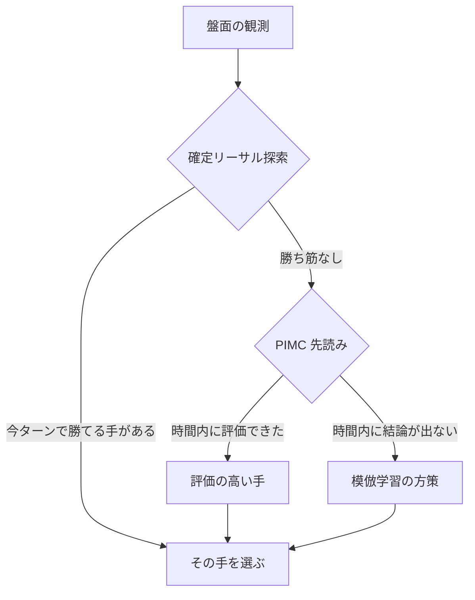
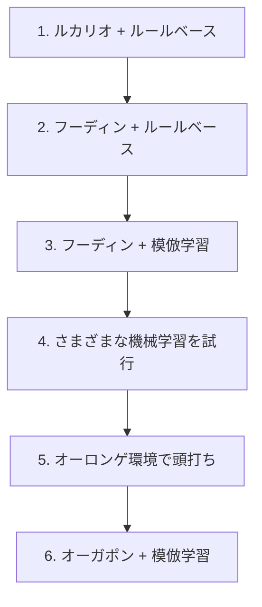

# Pokémon TCG AI Battle Challenge

大学の研究室のメンバー4人で、ポケモンカードゲームを自律的にプレイする AI エージェントを開発した。[Pokémon Trading Card Game AI Battle Challenge](https://ptcg-abc.pokemon.co.jp/) 第一ラウンド・シミュレーション部門（2026年6月16日〜8月17日）に参加し、Kaggle 上で他チームのエージェントと対戦させた。

**最終 365位 / 6,807チーム — 上位約5.4%、銅メダル。提出期限の2日前には31位（銀メダル圏）。**

| 提出期限2日前の最高順位 | 最終順位 |
|---|---|
|  |  |

このコンペのスコアは、提出したエージェントが対戦を続けるかぎり更新され続けるレーティング形式である。提出期限のあとも約2週間、エージェント同士の対戦が続き、そこで最終順位が決まる。31位はその評価期間に入る前の順位であり、最終スコアは 920.4 だった。スコアの推移は [大会結果と順位分析](docs/results.md) にまとめている。

開発したものは、提出する AI エージェント本体のほかに3つある。上位プレイヤーのリプレイからエージェントを学習させる仕組み、対戦を1手ずつ再生して判断を追えるビュアー、手元で大量に対戦させて改善を比較する評価環境である。

主催: Kaggle・株式会社ポケモン｜共催: 株式会社松尾研究所・HEROZ株式会社｜開催協力: Google・Google Cloud・NVIDIA（[公式サイト](https://ptcg-abc.pokemon.co.jp/)）

[作ったもの](#作ったもの) · [難しかった点](#難しかった点) · [AIの仕組み](#aiの仕組み) · [そこに至るまで](#そこに至るまで) · [メンバーと担当](#メンバーと担当) · [コードの入口](#コードの入口)

## 作ったもの

**AI エージェント（提出物）** — 盤面を受け取り、カードの使用・攻撃・エネルギー付与などの行動を選んで返す。勝ち筋の探索、相手の非公開情報を仮定した先読み、学習したモデルの3つを組み合わせて手を決める。

**学習の仕組み** — Kaggle 上の上位プレイヤーのリプレイを収集し、「その盤面で実際に選ばれた手」を教師データとしてモデルを学習させる。

**対戦ビュアー** — リプレイを1手ずつ再生し、盤面・選択肢・エージェントが選んだ手・相手デッキの推定を確認する。人間がエージェントと対戦する機能も持つ。

**評価環境** — 複数のエージェントを手元で総当たり対戦させ、変更前後の勝率を比較する。

**カード参照・印刷ツール** — 配布されたカード PDF を検索・整理し、紙のカードとして印刷する。

上はバトルビュアーの画面。両者の盤面、HP・エネルギー・サイドの残数、そのターンに発動した効果、エージェントが選んだ行動とその候補を1手ずつ追える。カード画像は各自の環境で生成する方式のため、この画面ではカード名のテキスト表示になっている。

## 難しかった点

動くエージェントを作ること自体は難しくない。難しいのは、その先で強さを上げることだった。変更が本当に効いているのかを判定する手段がなく、そこに開発時間の多くを使っている。

**相手の情報が見えない。** 相手の手札・山札・サイドは非公開である。見えている盤面から相手の持ち物を推定しながら意思決定する必要がある。

**環境が動く。** 他チームが使うデッキの分布は日々変わる。自分たちが何も変えていなくても、流行のデッキが変われば勝率が変わる。終盤にデッキを変更した理由も、この環境変化である。

**1試合の結果に運の影響が大きい。** 引いたカード次第で勝敗が変わるため、勝率が上がったのか、たまたま勝てただけなのかを区別しにくい。手元の評価で ±2pt の差を有意に判定するには、数千試合を回す必要があった。

**フィードバックが遅い。** 提出は1日5回まで。しかもスコアは対戦が積み重なるまで落ち着かないため、1回の提出結果から改善の可否を判断できない。提出物を変更していなくても、同一提出のスコアの振れ幅は中央値で 173点あった。

## AIの仕組み

最終エージェントは、オーガポンデッキと3段構えの意思決定からなる。デッキは、提出当時の環境で多かった相手に有利なものを選んだ。

1. **確定リーサル探索** — このターンに相手を倒し切って勝てる手順があるかを調べる。あれば、それ以上考える必要がない。
2. **PIMC 先読み** — 見えていない相手の手札や山札を確率的に仮定（決定化）したうえで数手先まで読み、平均的に良い手を選ぶ。
3. **模倣学習の方策** — 上位プレイヤーのリプレイから「その盤面で実際に選ばれた手」を学習したモデル。探索が時間内に終わらない場面を受け持つ。

実装の入口は [`sample_submission/README.md`](sample_submission/README.md)。対戦中の観測を受け取り、行動を返す `agent()` 関数から処理が始まる。

## そこに至るまで

デッキとアルゴリズムを交互に見直しながら、次の順で構成を変えた。

最後のデッキ変更では、方策を据え置いてデッキだけを差し替え、9,990試合のホールドアウトで勝率 0.701 → 0.762（+6.11pt、95%信頼区間 [+4.88, +7.33]）を確認してから採用した。これは手元の評価環境での数字であり、Kaggle 上の勝率とは別物である。

<b>各段階で何をして、何が分かったか（クリックで開く）</b>

**1. ルカリオデッキ ＋ ルールベース** — まず動くものを作ることを優先した。扱いやすいルカリオデッキを選び、条件分岐で行動を決めるエージェントを実装している。

**2. フーディンデッキ ＋ ルールベース** — 環境で流行していたこと、手札を増やしながら戦う動きが強いと判断したことから、デッキをフーディンに変更した。ルールベースのまま、このデッキの動きに合わせて作り直している。

**3. フーディンデッキ ＋ 模倣学習** — ルールベースは、記述した範囲でしか判断できない。上位プレイヤーのリプレイから「その盤面で実際に選ばれた手」を教師として学習させれば、自分たちが言語化できていない判断も獲得できるのではないか、という仮説で模倣学習に移行した。

**4. さまざまな機械学習の試行** — 盤面の有利不利を点数で見積もるバリューネットワーク、強化学習、探索との組み合わせなどを試した。

**5. オーロンゲ環境で頭打ち** — フーディンに強いオーロンゲデッキが流行し始めた。方策や探索を改善してこの対面を取りに行こうとしたが、勝率は上がらない。**デッキ相性の差はプレイングでは埋めきれない**、というのがこの段階での結論である。

**6. オーガポンデッキ ＋ 模倣学習** — オーロンゲに強いオーガポンデッキへ乗り換えた。上の比較で効果を確認してから採用している。

この一連で明確な差が出たのは、デッキの選択だった。方策の改良による差は、多くが試合ごとのばらつきに埋もれている。

## うまくいかなかったこと

試して駄目だったものも残している。

**相手デッキの予測を方策に渡す。** 見えているカードから相手のデッキタイプを推定するモデルを作り、推定の精度自体は出た。しかしその予測を方策の入力に加えても、勝率は改善しなかった。盤面の情報にすでに相手の情報が反映されており、冗長だったと見ている。

**長期的な計画・深い先読み。** 探索を深く、広くしても勝率は改善しなかった。1手あたりの時間に上限があるため、深さを増やすと試行回数が減り、差し引きで得をしない。

**Transformer による方策。** 盤面を系列として扱うモデルを試したが、既存の方策を超えられなかった。

ただし、これらは手法そのものを否定する結果ではない。限られた期間で試した範囲で改善を検出できなかった、というだけである。1手あたり2秒という時間制限、教師にできたリプレイの量、予測の与え方——このどれかを変えれば結論も変わりうる。追試を続けるより、デッキの選択に時間を使うほうが勝率に効くと判断して打ち切っている。

## チームでの進め方

研究室で「ハッカソンに出てみたい」「技術力を上げたい」という話が出ていたところに、このコンペを見つけて参加を決めた。

**紙で回してデッキを選んだ。** どのデッキが強いかを把握するため、配布されたカード PDF から実物を印刷するツールを作り、紙のカードでプレイして確かめた。

**見えないものを見えるようにした。** Kaggle 上では対戦画面しか確認できず、デッキが意図どおり動いているか、相手デッキの推定が盤面ごとに機能しているかを検証できない。そこでリプレイを1手ずつ再生できるバトルビュアーを実装した。

**週2回の勉強会。** 全員が機械学習に詳しくなかったため、勉強会を開いた。各自が読んだ本の内容をスライドで共有し、進捗の確認と次の方針決めもここで行っている。

**分担のやり方を途中で変えた。** どの手法が効くかは事前に分からず、機能ごとに担当を固定するやり方では進まなかった。各自が別々の手法を試して結果を持ち寄り、成果が出たものにチーム全体で集中する形に切り替えている。

**判断の基準をルールにした。** AI の構成はブランチではなく config で切り替える、常に提出できる安定版を残す、強さは勝率と実験記録で判断する。こうした取り決めを [チーム開発ルール](docs/team-development-rules.md) にまとめ、4人で共有した。

## メンバーと担当

| メンバー | 主な担当 |
|---|---|
| [@Showgo1130](https://github.com/Showgo1130) | 対戦記録からの学習、モデルの組み込み、ビュアーと評価環境 |
| [@tsuoimorioka](https://github.com/tsuoimorioka) | 探索アルゴリズム、思考時間の制御、自己対戦による強化学習の試行 |
| [@koshincarrier-pixel](https://github.com/koshincarrier-pixel) | 条件分岐による行動判断、盤面の特徴量づくり、学習・評価 |
| [@inada107](https://github.com/inada107) | 勝ち切る手順の探索、学習モデルとの接続、デッキごとの戦術 |

→ [担当の詳細とチームの取り組み](docs/development-story.md#メンバーの担当詳細)

## コードの入口

| 見たいもの | 場所 |
|---|---|
| 提出した AI の実装 | [提出エージェントの構成](sample_submission/README.md) · [`agent()` のコード](sample_submission/main.py) |
| 対戦ビュアー | [battle_review_viewer/](battle_review_viewer/README.md) |
| 学習・評価環境 | [リプレイ収集と学習データ生成](kaggle_replays/README.md) · [総当たり対戦のリーグ](league/README.md) |
| 検証コード | [テストとローカル対戦の構成](sample_submission/tests/README.md) |
| カード参照・印刷ツール | [cardlist_referenced/](cardlist_referenced/README.md) |

実行には Python 3.12 以上と、[Kaggle 配布のコンペデータ](https://www.kaggle.com/competitions/pokemon-tcg-ai-battle/data) が必要になる。配置と手順は各ディレクトリの README にある。カード画像は配布 PDF から各自の環境で生成する方式のため、リポジトリには含めていない。

提出したモデルは、使用デッキ・設定・重みのハッシュと、採用を決めた評価結果をあわせて [`sample_submission/models/`](sample_submission/models/) に凍結してある。

## もっと詳しく

- [開発の経緯とチームの取り組み](docs/development-story.md) — 各段階の背景と、メンバー4人それぞれの担当の内訳
- [大会結果と順位分析](docs/results.md) — 最終成績、スコアの推移と31位の位置づけ、対戦相手の変化
