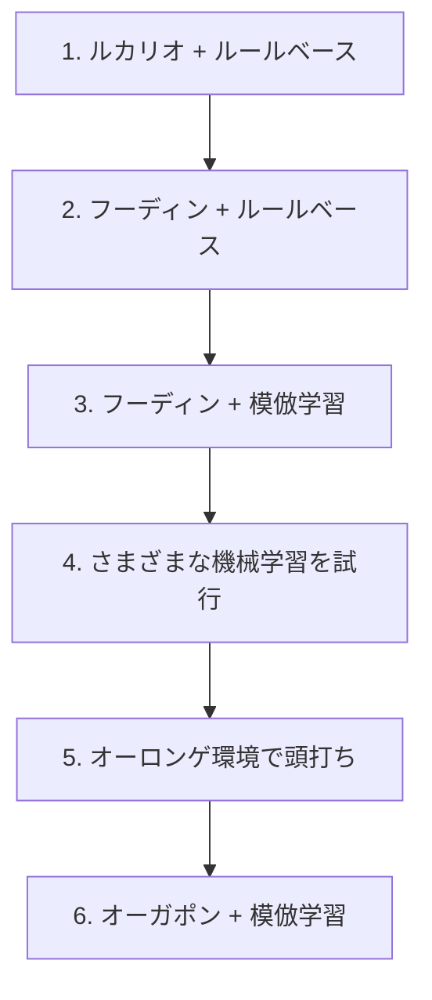

# 開発の経緯とチームの取り組み

[トップページへ戻る](../README.md) · [大会結果と順位分析](results.md)

トップページに書いた「難しかった点」「そこに至るまで」「うまくいかなかったこと」を、背景まで含めて書いたページ。最後にメンバー4人それぞれの担当の内訳を載せる。

## 参加の経緯

研究室で「ハッカソンに出てみたい」「技術力を上げたい」という話が出ていたところに、このコンペを見つけた。カードゲームの AI という題材が面白そうだったことと、時期が重なったことで参加を決めている。

## このコンペの何が難しいのか

一般的な機械学習コンペとは、難しさの種類が違った。動くエージェントを作るところまでは早い。そこから強さを上げる段になって、次の4点が効いてくる。

**相手の情報が見えない。** 相手の手札・山札・サイドは非公開である。見えている盤面から相手の持ち物を推定しながら意思決定する必要がある。

**環境が動く。** 他チームが使うデッキの分布は日々変わる。自分たちが何も変えていなくても、流行のデッキが変われば勝率が変わる。終盤の方針転換も、この環境変化が理由である。

**1試合の結果に運の影響が大きい。** 引いたカード次第で勝敗が変わるため、勝率が上がったのか、たまたま勝てただけなのかを区別しにくい。小さな勝率差を見分けるには、多数の試合と、検出したい差に応じた評価設計が要る。手元の評価で ±2pt を有意に判定するには、数千試合が必要だった。

**フィードバックが遅い。** 提出は1日5回まで。しかも提出してもスコアが落ち着くまでに時間がかかるため、手元の改善が順位に効いたのかを1回の提出結果から判断できない。そこで提出ごとのスコアを記録し続け、振れ幅そのものを実測した（[`kaggle_replays/_lb_history.tsv`](../kaggle_replays/_lb_history.tsv)）。追跡した提出では、振れ幅は中央値で 173点あった。

## デッキとアルゴリズムの変遷

デッキとアルゴリズムの両方を、交互に見直しながら進めた。

**1. ルカリオデッキ ＋ ルールベース**
まず動くものを作ることを優先した。扱いやすいルカリオデッキを選び、条件分岐で行動を決めるエージェントを実装している。

**2. フーディンデッキ ＋ ルールベース**
環境で流行していたこと、手札を増やしながら戦う動きが強いと判断したことから、デッキをフーディンに変更した。ルールベースのまま、このデッキの動きに合わせて作り直している。

**3. フーディンデッキ ＋ 模倣学習**
ルールベースは、記述した範囲でしか判断できない。上位プレイヤーのリプレイから「その盤面で実際に選ばれた手」を教師として学習させれば、自分たちが言語化できていない判断も獲得できるのではないか、という仮説で模倣学習に移行した。

**4. さまざまな機械学習の試行**
盤面の有利不利を点数で見積もるバリューネットワーク、強化学習、先読みとの組み合わせなどを試した。効果を確認できなかった代表的なものは、下の「うまくいかなかったこと」にまとめている。

**5. オーロンゲ環境で頭打ち**
フーディンに強いオーロンゲデッキが流行し始めた。方策や先読みを改善してこの対面を取りに行こうとしたが、手元の評価では勝率が上がらない。**デッキ相性の差はプレイングでは埋めきれない**、というのがこの段階での結論である。

**6. オーガポンデッキ ＋ 模倣学習**
オーロンゲに強いオーガポンデッキへ乗り換えた。方策は据え置き、デッキだけを差し替えた比較で効果を確認してから採用している（9,990試合のホールドアウトで勝率 0.701 → 0.762、+6.11pt / 95%信頼区間 [+4.88, +7.33]）。これは手元の評価環境での数字であり、Kaggle 上の勝率とは別物である。

この一連で明確な差が出たのは、デッキの選択だった。デッキを変えたときの差は手元の評価でもはっきり検出できた一方、方策の改良による差は、多くが試合ごとのばらつきに埋もれている。

## うまくいかなかったこと

試して駄目だったものも残している。

**相手デッキの予測を方策に渡す。** 見えているカードから相手のデッキタイプを推定するモデルを作り、推定の精度自体は出た。しかしその予測を方策の入力に加えても、手元の評価では勝率が改善しなかった。盤面の情報にすでに相手の情報が反映されており、冗長だったと見ている。

**長期的な計画・深い先読み。** 探索を深く、広くしても、手元の評価では勝率が改善しなかった。1手あたりの時間に上限があるため、深さを増やすと試行回数が減り、差し引きで得をしない。

**Transformer による方策。** 盤面を系列として扱うモデルを試したが、既存の方策を超えられなかった。

いずれも手法の否定ではなく、この条件で差が出なかったということである。相手デッキ予測は入力に連結する形しか試しておらず、深い先読みは1手2秒が前提、Transformer は教師データの量が頭打ちの一因だった可能性がある。追試よりデッキ選択に時間を回すほうが効くと判断し、打ち切った。

## チームでの進め方

進め方は、開発が進むにつれて次の順に変えている。

**1. 紙で回してデッキを選んだ。** 最初に必要だったのは、どのデッキが強いかを知ることだった。配布されたカード PDF から実物を印刷するツールを作り、紙のカードでプレイして確かめている。

**2. バトルビュアーで対戦を見返せるようにした。** Kaggle 上では対戦画面しか確認できず、提出も1日5回までである。デッキが意図どおり動いているか、相手デッキの推定が盤面ごとに機能しているかを検証できないため、リプレイを1手ずつ再生できるビュアーを実装した。

**3. 判断の基準をルールにした。** AI の構成はブランチではなく config で切り替える、常に提出できる安定版を残す、強さは勝率と実験記録で判断する。こうした取り決めを [チーム開発ルール](team-development-rules.md) にまとめ、4人で共有した。

**4. 分担のやり方を変えた。** どの手法が効くかは事前に分からず、機能ごとに担当を固定するやり方では性能改善が進まなかった。各自が別々の手法を試して結果を持ち寄り、成果が出たものにチーム全体で集中する形に切り替えている。

期間を通して、週2回の勉強会を続けた。全員が機械学習に詳しくなかったため、各自が読んだ本の内容をスライドで共有し、進捗の確認と次の方針決めもここで行っている。

## メンバーの担当詳細

### [@Showgo1130](https://github.com/Showgo1130) — 学習モデルと、開発・評価の道具

- 対戦を1手ずつ見返すバトルビュアー
- 配布 PDF から紙のデッキを刷るツール
- Kaggle のリプレイを集めて学習データにする仕組み
- 上位プレイヤーの手を学習させる仕組み（特徴量づくり・学習・評価）
- 学習したモデルを提出エージェントに載せる実装
- 勝率を予測するモデルと、相手が何のデッキかを当てるモデル
- 相手の手札・山札の推定と、それを使った先読み
- エージェント同士を総当たりさせるリーグ
- 環境にどのデッキが何割いるかの調査
- デッキ候補を多段階で絞り込む仕組み
- 改善が本物かを判定する A/B 評価と、提出スコアの継続記録

### [@tsuoimorioka](https://github.com/tsuoimorioka) — 探索アルゴリズムと強化学習

- 試行をくり返して手を評価するモンテカルロ探索
- 勝ち切れる手順を探す探索の最初の実装
- 1手にかける時間の配分制御
- 自己対戦で強くしていく学習器（PPO）と、Transformer を使った手の選び方
- 学習が進みやすくなる報酬の設計（勝敗だけでなく途中経過も反映させる）
- 相手の強さによって手の評価がぶれる問題の補正
- 学習を複数マシン・Kaggle 上で同時に回す仕組み
- 特定デッキ向けの打ち方をあらかじめ用意する仕組み（効果を確認できず開発中止）
- 練習相手になるルールベースのエージェント
- 使用デッキの構成更新（ドラパルト、フーディン）と、提出エージェントの入口

### [@koshincarrier-pixel](https://github.com/koshincarrier-pixel) — ルールベースの判断ロジック

- 条件分岐で行動を決めるエージェントの中核
- エネルギーを誰に付けるかの判断
- 「にげる」かどうかの判断
- グッズ・サポート・スタジアムを使ってよい条件の判定
- 毎ターンカードを引く手段の確保
- カードのテキストから、状況で変わる技のダメージを見積もる処理
- 盤面をモデルに渡すときの表し方の拡張（手札の中身・先攻後攻など）
- 学習モデルの再学習と、前のモデルとの比較検証
- 学習データを増やしたときの伸び方の測定と、効果がなかった案の記録
- Kaggle 上で学習を回す仕組みと、リプレイ収集の高速化

### [@inada107](https://github.com/inada107) — 勝ち切る手順の探索とデッキ戦術

- 勝ち切る手順を見つける探索の本体（最終エージェントの1段目）
- その探索を学習モデルと接続し、提出設定に組み込むところまで
- 「にげる」判断への、相手に倒される確率の見積もりの導入
- デッキごとの方針と、カード1枚ずつの扱いを記述するプロファイル
- 特定デッキ専用のルールベースエージェント
- 相手デッキの予測を、行動の優先度に反映させる配線
- 開発用のツール類とテストの整備

> ブランチとコミットの実績から整理したもので、本人しか把握していない作業は拾えていない可能性がある。
