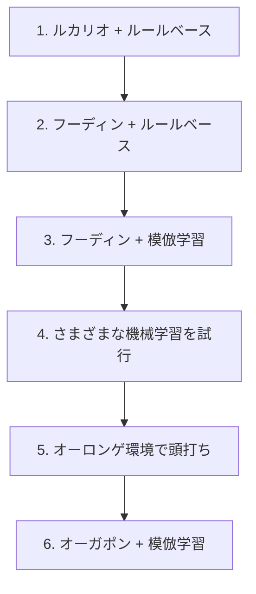

# 開発の経緯とチームの取り組み

[トップページへ戻る](../README.md) · [大会結果と順位分析](results.md)

## 参加の経緯

研究室で「ハッカソンに出てみたい」「技術力を上げたい」という話が出ていたところに、このコンペを見つけました。カードゲームの AI という題材が面白そうだったことと、時期が重なったことで参加を決めています。

## このコンペの何が難しいのか

一般的な機械学習コンペとは、難しさの種類が違いました。

**相手の情報が見えない。** 相手の手札・山札・サイドは非公開です。見えている盤面から相手の持ち物を推定しながら意思決定する必要があります。

**1試合の結果に運の影響が大きい。** 引いたカード次第で勝敗が変わるため、勝率が上がったのか、たまたま勝てただけなのかの区別が難しくなります。小さな勝率差を見分けるには、多数の試合と、検出したい差に応じた評価設計が必要でした。

**フィードバックが遅い。** 提出は1日5回までです。しかも提出しても、スコアが落ち着くまでに時間がかかります。手元で改善しても、それが順位に効いたのかを提出1回の結果からは判断できません。そこで提出ごとのスコアを記録し続け、どれくらい振れるのかを自分たちで測りました（`kaggle_replays/_lb_history.tsv`）。追跡した提出では、振れ幅は中央値で173点ありました。

**環境が動く。** 他チームが使うデッキの分布は日々変わります。自分たちが何も変えていなくても、流行のデッキが変われば勝率が変わります。実際、この「環境の変化」が終盤の方針転換の理由になりました。

## デッキとアルゴリズムの変遷

デッキとアルゴリズムの両方を、交互に見直しながら進めました。

**1. ルカリオデッキ ＋ ルールベース**
まず動くものを作ることを優先しました。扱いやすいルカリオデッキを選び、条件分岐で行動を決めるエージェントを実装しています。

**2. フーディンデッキ ＋ ルールベース**
環境で流行っていたこと、手札を増やしながら戦う動きが強いと判断したことから、デッキをフーディンに変更しました。ルールベースのまま、このデッキの動きに合わせて作り直しています。

**3. フーディンデッキ ＋ 模倣学習**
ルールベースは、書いたぶんしか強くなりません。上位プレイヤーのリプレイから「その盤面で実際に選ばれた手」を教師として学習させれば、自分たちが言語化できていない判断も獲得できるのではないか、という仮説で模倣学習に移行しました。

**4. さまざまな機械学習の試行**
盤面の有利不利を点数で見積もるモデル（バリューネットワーク）、強化学習、先読みとの組み合わせなどを試しました。効果を確認できなかった代表的な施策は、下の「うまくいかなかったこと」にまとめています。

**5. オーロンゲ環境で頭打ち**
フーディンに強いオーロンゲデッキが流行し始めました。AI の判断ロジックや先読みを改善してこの対面を取りに行こうとしましたが、手元の評価では勝率が上がりませんでした。**デッキ相性の差はプレイングでは埋めきれない**、というのがこの段階での結論です。

**6. オーガポンデッキ ＋ 模倣学習**
オーロンゲに強いオーガポンデッキへ乗り換えました。AI 側は一切変えず、デッキだけを差し替えて、環境に多いデッキを再現した相手と**手元で約1万試合**を回し、勝率が 70.1% → 76.2% に上がることを確かめてから採用しました（これは手元の評価環境での数字で、Kaggle 上の勝率とは別のものです）。

この一連で分かったのは、**はっきり効果を確認できたのはデッキの変更だった**ということです。デッキを変えたときの差は手元の評価でも明確に出た一方、AI 側の改良による差は、ほとんどが試合ごとの運のばらつきに埋もれてしまいました。

## うまくいかなかったこと

効果が出なかった施策も残しています。

**相手のデッキ予測を AI に渡す。** 見えているカードから相手のデッキタイプを推定するモデルを作り、推定の精度自体は出ました。しかしその予測を判断材料として渡しても、手元の評価では勝率が改善しませんでした。盤面の情報にすでに相手の情報が反映されており、冗長だったと考えています。

**長期的な計画・深い先読み。** 探索を深く、広くしても、手元の評価では勝率が改善しませんでした。1手あたりの時間には上限があるため、深さを増やすと試行回数が減り、差し引きで得をしませんでした。

**Transformer を使ったモデル。** 盤面を文章のような並びとして扱うモデルを試しましたが、それまでのモデルを超えられませんでした。

いずれも、勝率が上がらなかったこと自体より、**改善を確認できた施策と、確認できなかった施策を分けて判断したこと**が成果だったと考えています。

## チームでの進め方

**紙で回してデッキを選んだ。** 最初にやるべきは、どのデッキが強いのかを知ることでした。配布されたカードPDFから実物を印刷するツールを作り、実際に紙のポケモンカードでプレイして確かめています。

**見えないものを見えるようにした。** Kaggle 上では対戦画面しか確認できず、提出も1日5回までです。デッキが意図どおり動いているか、相手デッキの推定が盤面ごとに機能しているかを確認できないため、リプレイを1手ずつ再生できるバトルビュアーを自作しました。

**週2回の勉強会。** 全員が機械学習に詳しくなかったため、勉強会を開きました。各自が読んできた本の内容をスライドで共有し、あわせて進捗の確認と次の方針決めも行っています。

**分担のやり方を途中で変えた。** どの手法が効くか事前に分からず、機能ごとに担当を固定するだけでは性能改善を進めにくいと感じました。そこで、各自が別々の手法を試して結果を共有し、成果が出たものにチームで集中する形に切り替えました。力を入れる場所を絞れるようになりました。

## メンバーの担当詳細

### [@Showgo1130](https://github.com/Showgo1130) — 学習モデルと、開発・評価の道具

- 対戦を1手ずつ見返すバトルビュアー
- 配布 PDF から紙のデッキを刷るツール
- Kaggle のリプレイを集めて学習データにする仕組み
- 上位プレイヤーの手を学習させる仕組み（特徴量づくり・学習・評価）
- 学習したモデルを提出エージェントに載せる実装
- 勝率を予測するモデルと、相手が何のデッキかを当てるモデル
- 相手の手札・山札の推定と、それを使った先読み
- エージェント同士を総当たりさせるリーグ
- 環境にどのデッキが何割いるかの調査
- デッキ候補を多段階で絞り込む仕組み
- 改善が本物かを判定する A/B 評価と、提出スコアの継続記録

### [@tsuoimorioka](https://github.com/tsuoimorioka) — 探索アルゴリズムと強化学習

- 試行をくり返して手を評価するモンテカルロ探索
- 勝ち切れる手順を探す探索の最初の実装
- 1手にかける時間の配分制御
- 自己対戦で強くしていく学習器（PPO）と、Transformer を使った手の選び方
- 学習が進みやすくなる報酬の設計（勝敗だけでなく途中経過も反映させる）
- 相手の強さによって手の評価がぶれる問題の補正
- 学習を複数マシン・Kaggle 上で同時に回す仕組み
- 特定デッキ向けの打ち方をあらかじめ用意する仕組み（効果を確認できず開発中止）
- 練習相手になるルールベースのエージェント
- 使用デッキの構成更新（ドラパルト、フーディン）と、提出エージェントの入口

### [@koshincarrier-pixel](https://github.com/koshincarrier-pixel) — ルールベースの判断ロジック

- 条件分岐で行動を決めるエージェントの中核
- エネルギーを誰に付けるかの判断
- 「にげる」かどうかの判断
- グッズ・サポート・スタジアムを使ってよい条件の判定
- 毎ターンカードを引く手段の確保
- カードのテキストから、状況で変わる技のダメージを見積もる処理
- 盤面をモデルに渡すときの表し方の拡張（手札の中身・先攻後攻など）
- 学習モデルの再学習と、前のモデルとの比較検証
- 学習データを増やしたときの伸び方の測定と、効果がなかった案の記録
- Kaggle 上で学習を回す仕組みと、リプレイ収集の高速化

### [@inada107](https://github.com/inada107) — 勝ち切る手順の探索とデッキ戦術

- 勝ち切る手順を見つける探索の本体（最終エージェントの1段目）
- その探索を学習モデルと接続し、提出設定に組み込むところまで
- 「にげる」判断への、相手に倒される確率の見積もりの導入
- デッキごとの方針と、カード1枚ずつの扱いを記述するプロファイル
- 特定デッキ専用のルールベースエージェント
- 相手デッキの予測を、行動の優先度に反映させる配線
- 開発用のツール類とテストの整備

> ブランチとコミットの実績から整理したものです。本人しか把握していない作業は拾えていない可能性があります。また master に統合していない作業ブランチがあり、統合後に見直す予定です。
