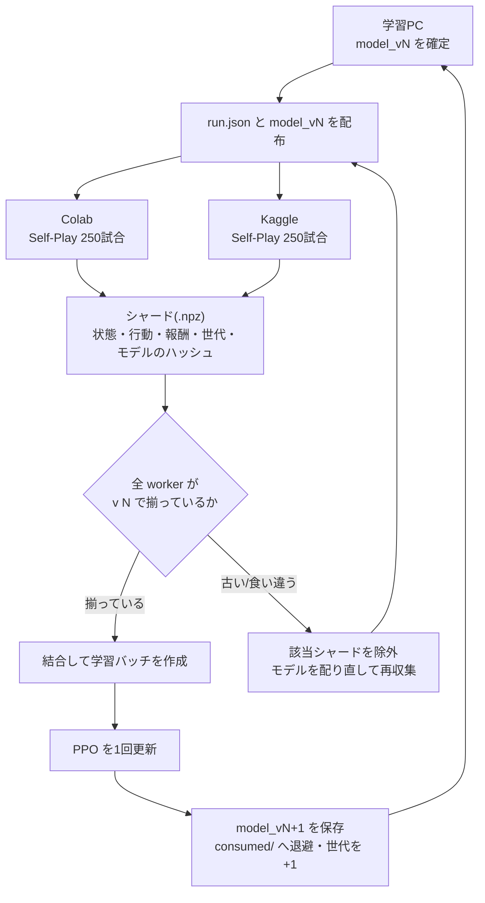

# 分散 Self-Play(試合生成を複数マシンへ、学習は1台)

試合の生成だけを Colab / Kaggle などへ逃がし、PPO の更新は学習PC1台で行う仕組み。



## なぜ分けられるか

この学習で重いのは**試合の生成**で、PPO の更新自体はごく軽い(パラメータ約17,857個)。
収集は pure-Python 方策 + `cg` エンジンだけで完結するので、**worker 側に torch は要らない**。

やりとりするファイルも小さい。

| 向き | 中身 | 大きさの目安 |
|---|---|---|
| 学習PC → worker | `run.json` + `models/model_v<N>.json` | 約 1 MB |
| worker → 学習PC | `shards/v<N>/<worker_id>.npz` | 250試合で 約 1.2 MB |

## ファイル

| ファイル | 役割 | torch |
|---|---|---|
| `init_run.py` | run を新規作成(学習PCで1回) | 不要 |
| `worker.py` | 試合生成 → シャード出力 | **不要** |
| `learner.py` | シャード集約 → PPO更新 → 次世代 | 必要 |
| `common.py` | 世代管理・シャード入出力・整合性検査 | 不要 |
| `test_distributed.py` | 一巡と各種ガードの検証 | 必要 |

## 使い方

### 1. run を作る(学習PC、最初の1回だけ)

```bash
python init_run.py --run-id dragapult_v1 --learner-arch dragapult_ex --opponent-arch alakazam --workers colab kaggle --games-per-worker 250
```

`kaggle_replays/rl/runs/dragapult_v1/` ができる。`--workers` に並べた名前と**順番**がシードの
割り当てを決めるので、あとから並べ替えないこと。

### 2. 配る

`run.json` と `models/model_v<N>.json` を各 worker へ。

### 3. 各 worker で回す

```bash
python worker.py --run-dir <run_dir> --worker-id colab
```

試合数・温度・相手・デッキはすべて `run.json` から読む。コマンドラインで変えられないのは
わざとで、PC ごとに条件がずれたデータが PPO 更新に混ざるのを仕組みとして防いでいる。
`--workers` はそのマシンで使う並列プロセス数(既定 = CPU数)で、これだけは変えてよい。

### 4. 集める

各 worker が書いた `.npz` を学習PCの `shards/v<N>/` へ集める。

`learner.py` は起動時に**ブラウザのダウンロードフォルダを自動で見て、今の世代のシャードが
あれば取り込む**。Colab から落としたファイルを置き直す必要はない。判定はファイル名ではなく
中のメタデータ(run_id・世代・モデルのハッシュ・worker 名)で行うので、`colab (1).npz` の
ような名前でも正しく `colab` の提出として扱われる。合わないファイルは無視する。元ファイルは
消さずにコピーする。

- 別の場所を見せたい: `--inbox <フォルダ>`
- 見に行かせたくない: `--no-inbox`

```bash
python learner.py --run-dir <run_dir> --status   # 揃い具合を確認
python learner.py --run-dir <run_dir>            # 1世代ぶん更新
```

`--status` は各シャードの合否と未提出の worker を表示するだけで、何も変更しない。
更新が成功すると `models/model_v<N+1>.json` ができ、`run.json` の世代が1つ進む。あとは
2に戻って繰り返す。

評価も回すなら `--eval-games 400` を付ける(学習PCで対戦するので、その分時間がかかる)。

## 世代がずれないための仕組み

PPO は「収集したときの方策」と「更新する方策」が同じである前提の手法なので、古い世代の
経験が1つでも混ざると更新が壊れる。次の5つで守っている。

1. **モデルの中身のハッシュで照合する。** シャードには世代番号だけでなく `model_v<N>.json`
   の SHA-256 を記録する。世代番号は合っているのに中身が違う(配り忘れ・取り違え)は
   番号だけでは見抜けないため。
2. **1つでも食い違ったら弾く。** 世代・ハッシュ・収集量・温度・相手設定のどれかが
   `run.json` と違うシャードは、黙って除外せず理由付きで報告する。
3. **worker が揃うまで更新しない。** 未提出があると既定で止まる(`--allow-partial` で続行可、
   ただし世代ごとに収集量が変わる点は承知の上で)。
4. **使った経験は退避する。** 更新に使ったシャードは `shards/consumed/v<N>/` へ移動し、
   `run.json` の世代も進むので、同じ経験が2回 PPO に入ることはない。
5. **同じ世代を2回更新できない。** `model_v<N+1>.json` が既にあれば learner は止まる。

### 乱数シード

世代 `g`・worker 番号 `i` は `g*100,000,000 + i*1,000,000` から始まる範囲を使う。世代間でも
worker 間でも範囲が重ならない(最大100台・1台あたり最大100万試合まで)。

ただし**ゲームエンジン側のシャッフルはこのシードでは制御されない**(`cg` が内部で乱数を持つ)。
つまりシードが同じでも試合内容は毎回変わるので、「同じ試合を重複して集めてしまう」ことは
そもそも起きない。シードを分けているのは行動サンプリングの系列を分離し、あとから追跡できる
ようにするため。

### critic と optimizer の引き継ぎ

価値関数(critic)と Adam の内部状態は `state/trainer_v<N>.pt` に保存し、次の世代で読み込む。
ここを毎世代作り直すと GAE(利得の推定)の基準がリセットされて学習が進まない。learner は
このファイルが無いと警告を出す。

## train_v3.py との違い

### 温度の扱い(意図的な修正)

worker は `softmax(scores / T)` で行動を選ぶが、`train_v3.py` は重要度比を `log_softmax(scores)`
で計算しており、温度を無視している。`T = 1.0`(既定)なら一致するが、それ以外ではずれる。
実測値:

```
T=1.0:  learner.py の比のずれ 2.15e-06   train_v3 の比のずれ 2.15e-06(誤差のみ)
T=1.3:  learner.py の比のずれ 1.55e-06   train_v3 の比のずれ 7.91e-01(平均 1.17e-01)
```

`learner.py` は収集時と同じ温度で softmax を取るので、`T` を変えても比は1から動かない。
`train_v3.py` 側は直していない(既存の実験結果との比較が崩れるため)。**`train_v3.py` を
`--temperature 1.0` 以外で使うときは、この点を承知しておくこと。**

### ミニバッチ

worker を増やすとバッチが大きくなりメモリを圧迫するので、既定で決定点16,384件ずつに
分けて更新する(`run.json` の `ppo.minibatch_size`)。`0` にすると全件まとめて更新する
= `train_v3.py` と同じ挙動になる。

## Colab / Kaggle での運用

`notebooks/` に実行用の一式がある。

| ファイル | 使い方 |
|---|---|
| `notebooks/colab_worker.ipynb` | Colab で開いて上から実行(zip を2つアップロードする) |
| `notebooks/kaggle_worker.ipynb` | Kaggle Notebook 本体。手で使ってもよい |
| `notebooks/push_kaggle.py` | **Kaggle 側をブラウザ無しで全自動化**。下記 |

### Kaggle は CLI だけで完結する

```bash
kaggle auth login                                   # 最初の1回だけ
python notebooks/push_kaggle.py --run-dir ../runs/<run_id>
```

`push_kaggle.py` は、配布用 zip の作成 → 非公開 Dataset へ登録(2回目以降はバージョン追加)
→ Notebook を push して実行 → 完了待ち → 出力の `.npz` を `<run_dir>/shards/v<N>/` へ回収、
までを1コマンドでやる。世代が進むたびに同じコマンドを叩けばよい。

Colab には同等の API が無いので、そちらはノートブックを開いて手で回す。

### 置き場をどうするか

両方から読み書きできる場所として **Kaggle の非公開 Dataset** が使える。Google ドライブは
Kaggle から触れないので、置き場には向かない。

- Kaggle Notebook — Dataset をそのまま読める。出力は Notebook の Output から回収する
- Colab — `pip install kaggle` + `kaggle.json` で同じ Dataset を読み書きできる

手作業でよければ、Colab はドライブ経由、Kaggle は Notebook の Output からダウンロード、でも回る。
1世代あたり往復数MBなので、手作業でも大した手間にはならない。

### 収集量の決め方

`games_per_worker` は全 worker 共通なので、**一番遅いマシンが1世代の所要時間を決める**。

| 環境 | 並列数 | 収集速度 | 出どころ |
|---|---|---|---|
| Kaggle Notebook | 4 | **2.9 試合/秒**(60試合を21秒) | 実測 |
| 手元 i7-14700F | 24 | 19.8 試合/秒 | 実測 |
| Colab 無料版 | 2 | 未計測 | — |

Kaggle は1コアあたりが遅く、**手元のマシンの4コアぶんから見積もった値(7.8試合/秒)の
4割ほどしか出ない**。250試合で約90秒。Colab は2コアなのでこれより更に遅いと見ておく。

1世代の所要時間は、収集そのものより Dataset のアップロードと反映待ち(後述)のほうが
効いてくる。試合数を欲張っても全体はあまり伸びないので、250〜500試合あたりが妥当。

### Linux での並列処理の起動方式(検証済み)

`worker.py` / `learner.py` は既定で `spawn`(子プロセスをまっさらから作る方式)を使う。

Linux の既定は `fork` で親プロセスをコピーするが、親は `run_league` 経由で `cg` エンジンを
読み込み済みなので、子が初期化済みのネイティブライブラリの状態を引き継ぐ形になる。Windows は
既定が `spawn` なのでこれが起きず、手元では問題ないのに Colab / Kaggle でだけ壊れる、という
出方をしうる。そこで既定を `spawn` に揃えた。

**Kaggle(Python 3.12.13 / 4コア)で両方を実測したところ、`spawn` も `fork` も問題なく
動いた。** 懸念は Kaggle では現実化しなかった。それでも既定を `spawn` のままにしてあるのは、
Windows で検証済みの経路と同じにしておくため。`--start-method fork` で切り替えられる。

ノートブックのセル「並列処理の起動方式を確定させる」が、この判定をその場でやり直す。

### Dataset の反映待ち(重要)

`kaggle datasets version` でアップロードしても、**新しい版が使えるようになるまで時間がかかる。**
すぐに Notebook を投げると1つ前の版が添付され、古い中身のまま実行される。ログには何の
異常も出ないので気づきにくい。

`push_kaggle.py` は `--dataset-wait`(既定90秒)だけ待ってから Notebook を push する。
さらに `kaggle_worker.ipynb` の側でも必要なファイルの有無を名指しで検査していて、古い版が
来ていればそこで止まる。待ちが足りないようなら `--dataset-wait 150` のように延ばす。

### セッションが切れる問題

Colab も Kaggle もセッションに時間制限がある。**1世代 = 1回の `worker.py` 実行**なので、
1世代ぶんの収集がセッション時間に収まっていれば、途中で切れても失われるのはその世代の
その worker のぶんだけで、モデルは無事。再実行すればやり直せる。

Kaggle は Notebook を保存して裏で実行できる(Save & Run All)ので、ブラウザを開いたまま
にしなくてよい。

## 対戦相手プール(将来の拡張)

最新モデル同士だけで回し続けると、過去に有効だった戦術を忘れたり、特定の型どうしで
堂々巡りになったりする。`run.json` の `opponents` は最初からリストになっていて、share の比で
試合数を配分するので、過去世代を混ぜるのは設定を足すだけでできる。

```json
"opponents": [
  {"id": "production_default", "weights": null,               "share": 0.5},
  {"id": "v5",                 "weights": "models/model_v5.json", "share": 0.3},
  {"id": "v10",                "weights": "models/model_v10.json","share": 0.2}
]
```

worker は相手ごとに試合数を分けてシード範囲もずらすので、コード変更は要らない。ただし
`opponents` を変えるとシャードの検査に引っかかるので、**世代の切れ目で変えること**。

**ルールベースAIを相手プールに入れるには、コードの変更が必要。** `collect_parallel.py` は
相手を `PolicyModel`(重みJSON)としてしか扱えないため、`opponents/dragapult_rule_agent.py`
のようなエージェントを混ぜるには `_init_worker2` / `_play_one` の相手側を差し替え可能に
する改修がいる。

## テスト

```bash
python test_distributed.py
```

1台で worker 2台ぶんを回して、以下を確認する(数分)。

1. init → worker×2 → learner → 世代が進む
2. 2台のシード範囲が重ならない
3. 未登録の worker-id は拒否される
4. **収集時と更新時の方策が一致している**(重要度比が1)
5. 使ったシャードが consumed/ へ退避される
6. 同じ世代を2回更新できない
7. 古い世代のシャードが弾かれる
8. 世代番号は同じでモデルの中身だけ違う場合も検出できる
9. critic / optimizer が世代をまたいで引き継がれる
