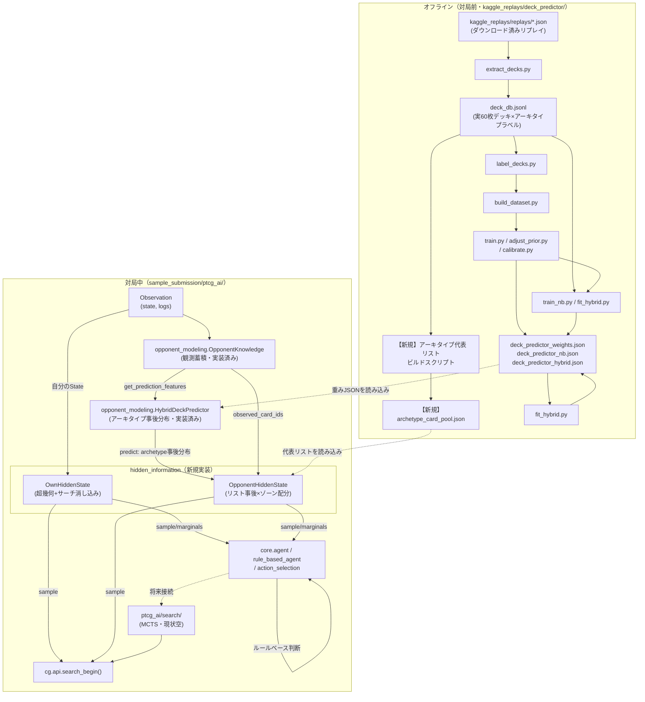

# 非公開情報推定レイヤー（hidden_information）設計書

作成日: 2026-07-20
配置予定モジュール: `sample_submission/ptcg_ai/hidden_information/`（現在は空パッケージ。`__init__.py` のみ）
関連（実装済み・入力として利用）: `sample_submission/ptcg_ai/opponent_modeling/`
関連（出力の消費者・現状未実装）: `sample_submission/ptcg_ai/search/`（空パッケージ）、`cg/api.py` の `search_begin()`

> ステータス: 方針合意済み。実装着手前の設計ドキュメント（本ファイル）。実装手順は
> [`implementation-plan.md`](./implementation-plan.md) を参照。

---

## 1. 目的・スコープ

対象は「自分・相手それぞれの、手札・山札・サイドの中身」の推定。

**やること**:
- 自分の山札とサイド6枚の切り分け・山札の順番の推定（ほぼ厳密計算）
- 相手のデッキリスト事後分布 × その中の未観測カードのゾーン配分、という2段の確率推定
- 上記を `cg/api.py` の `search_begin()` が要求する具体的な1組（手札・山札・サイドの card_id リスト）として取り出せる形で提供する（サンプラー）
- カード別・ゾーン別のマージナル確率を、ルールベース側の判断（例:「相手の手札にボスの指令がありそうか」）やビュアー表示向けに提供する（マージナル API）

**やらないこと（射程外・他モジュールの責務）**:
- 相手デッキアーキタイプそのものの予測 — `opponent_modeling.hybrid_predictor.HybridDeckPredictor` の役目。本レイヤーは `predict()` の出力を**入力として使うだけ**。
- 観測情報の蓄積そのもの — `opponent_modeling.opponent_knowledge.OpponentKnowledge` の役目。本レイヤーは `get_prediction_features()` の出力を**入力として使うだけ**。
- MCTS/探索アルゴリズム本体 — `ptcg_ai/search/`（現状空パッケージ）の役目。本レイヤーは `search_begin()` に渡す引数を作るところまでが責務。
- 手札の質的偏り（サーチ効果で持ってきたカードは「ポケモンを探した」等の条件がかかる）の精緻化。初版は「未観測プールからの一様サンプル」で済ませ、効果があると分かってから着手する（背景の合意方針どおり）。

---

## 2. なぜ必要か（現状のギャップ）

`cg/api.py` の `search_begin()` は、MCTS 等のゲーム木探索を始める前に、相手の非公開情報を**具体的な1組の card_id リスト**として渡すことを要求する:

```python
def search_begin(agent_observation, your_deck, your_prize,
                  opponent_deck, opponent_prize, opponent_hand, opponent_active, ...) -> SearchState
```

- `your_deck` / `your_prize`: 自分の山札・サイドの中身（推定値でよいと明記されている）
- `opponent_deck` / `opponent_prize` / `opponent_hand`: 相手の山札・サイド・手札の中身（完全に非公開）
- `opponent_active`: 相手のバトル場が伏せの場合のみ必要

現状、`ptcg_ai/search/` は空パッケージで `search_begin` の呼び出し元は存在しない。また `opponent_modeling` 側は「相手に何が見えたか（`observed`）」と「相手デッキは何アーキタイプか（`predict()` の確率分布）」までしか扱っておらず、**それを `search_begin` が要求する具体的な card_id 集合に変換する層が丸ごと欠けている**。`hidden_information` はこの欠落を埋める。

自分側についても、`your_deck` / `your_prize` は厳密には「今どのカードが山札にあり、どれがサイドに落ちているか」が本質的に不確定（伏せられているため、自分自身にも分からない）。ここも埋める必要があるが、後述のとおり相手側とは難易度が全く異なる。

---

## 3. なぜ自分側と相手側を別問題として設計するか

一見「隠れた情報の推定」という同じ種類の問題に見えるが、**既知情報量が桁違いに違う**。

### 自分側

- 60枚の中身は100%既知（自分が提出したデッキそのもの。`ptcg_ai/rule_based/rule_based_agent.py` の `read_deck_csv()` が返す60枚のリスト）
- 未知なのは「その60枚のうち、今どのカードが手札／場（アクティブ・ベンチ・付属エネルギー・道具）／トラッシュ以外（＝山札∪サイド）にあるか」の**切り分けだけ**
- さらに「山札の順番」はゲーム進行（何ターン後に何を引くか）に影響するが、**山札∪サイドのカード集合自体は多重集合として厳密に確定できる**（全部見えているゾーンを引き算するだけなので、誤差の入り込む余地がない）
- あるカードが山札ではなくサイド側に落ちている確率は、超幾何分布の**閉形式**で計算できる（後述 §4）

### 相手側

- 60枚のうち何が入っているかそのものが不明
- 「デッキリスト（アーキタイプ）が何か」の不確実性 × 「そのリスト内で、まだ見えていないカードが山札／手札／サイドのどこにあるか」の不確実性、という**二重の不確実性**が重なる
- リスト自体の推定は既存の `opponent_modeling.hybrid_predictor.HybridDeckPredictor`（LR×NBハイブリッド、21アーキタイプ）に完全に依存する。ここで独自の推定器を作る必要はない
- → 真の確率モデルが必要

この非対称性を1つの抽象で扱おうとすると、自分側の「本来は組み合わせ論だけで済む」部分まで不必要に確率モデル化することになり、無駄な計算コストと精度劣化（本来100%確定できる情報をわざわざ確率で近似する）を生む。よって最初から **`OwnHiddenState` と `OpponentHiddenState` を別クラス** として設計する。共通化するのは「サンプルされた1つの世界を `search_begin` の引数形式（card_id のフラットリスト）に変換する」ような、末端の薄い変換ロジックのみに留める。

---

## 4. 自分側の設計（OwnHiddenState）

### 4.1 状態の持ち方

自分の60枚から、公開済みゾーン（手札・場・トラッシュ）を引いた**未確認プール**（多重集合、`card_id -> 残り枚数`）を管理する。

```
未確認プール = 全60枚(card_id の多重集合)
              − hand(state.players[my_index].hand)
              − active/bench の本体・付属エネルギー・付属道具・進化元
              − discard(state.players[my_index].discard)
```

> **実装結果（2026-07-20）**: 上記の列挙には不足があった。自分が場に出したスタジアム
> （`state.stadium` のうち `card.playerIndex == state.yourIndex` のもの）も自分の60枚から
> 出ているため、公開ゾーンとして引き算する必要がある。実データ検証で欠落が判明し、
> `own_hidden_state.py` の `OwnHiddenState.update()` に追加済み（詳細は実装プラン Phase 1
> 「実装結果」参照）。

`PlayerState.hand` は自分視点では常に非 `None`（`cg/api.py` の docstring: "Hand Card Array. None for the opponent."）なので、上記の引き算に必要な情報は毎ターンの `State` から全て取得できる。

未確認プールは、`PlayerState.deckCount`（山札残り枚数）と `len(PlayerState.prize)`（サイド枚数。取られた分は要素が減る）に振り分けられる。**この2つの合計が未確認プールの総枚数と一致することを毎ターン検算できる**（実装のバグ検知に使える不変条件）。

### 4.2 サイド落ち確率（超幾何分布）

未確認プール中のあるカード（`card_id` の残り枚数 `k`）について、それが山札ではなくサイド側に `j` 枚落ちている確率は、標準的な超幾何分布の閉形式:

```
P(サイドにちょうど j 枚 | プール総数 M, サイド総数 n, 対象カード k 枚)
    = C(k, j) * C(M-k, n-j) / C(M, n)
```

`M = deckCount + len(prize)`、`n = len(prize)`。1枚が特定の1山（サイド）に落ちている周辺確率だけなら `n/M` に単純化できるが、「特定カードが少なくとも1枚サイドに落ちている確率」等、実戦でルールベース側が欲しい問いに答えるには `j` ごとの分布（またはその累積）を持てるようにしておく。

### 4.3 山札サーチによる決定的な消し込み

自分が山札をサーチする瞬間（`obs.select.context == SelectContext.LOOK` かつ `obs.select.deck is not None`。`SelectData.deck` は "An array of cards; None unless selecting cards from the deck." と定義されている）、**山札の中身が丸ごと公開される**。これは最大の情報源であり、他の推定と扱いを分ける:

- サーチで見えた山札の中に無かったカード（未確認プールに残っているのに山札に写っていないカード）は、**その瞬間サイド確定**として扱う。これは確率の更新ではなく、**ロジックによる決定的な消し込み**（if 文レベルの処理）。
- 一度サイド確定になったカードは、以後の超幾何計算の対象（＝未確定なプール）から除外する。

これにより、対戦が進んで何度もサーチを打つほど、自分のサイド落ち推定は徐々に「ほぼ全部確定」に収束していく。これは実際のゲームプレイの直感（サーチを打つほど残りの不確実性が減る）とも一致する。

### 4.4 計算コスト

多重集合の引き算と超幾何の閉形式のみで、反復計算や近似は不要。**毎手番フル再計算してよい**（パーティクルフィルタのような逐次更新・状態の持ち越しは不要で、むしろ「今の `State` から作り直す」方が実装がシンプルでバグりにくい）。

---

## 5. 相手側の設計（OpponentHiddenState・混合モデル）

### 5.1 全体構造: リスト事後分布 × ゾーン配分

```
P(相手の60枚の中身とゾーン配置)
    = Σ_archetype P(archetype | 観測) * P(ゾーン配置 | archetype, 観測)
```

2つの因子に分解する:

1. **リスト事後分布 `P(archetype | 観測)`**: 相手の60枚が「どのアーキタイプの代表リストか」の確率。**既存の `HybridDeckPredictor.predict(observed_cards, turn) -> dict[str, float]` をそのまま使う**（21アーキタイプ + `other` の確率分布、合計1.0）。ここで新しい推定器は作らない。
2. **ゾーン配分 `P(ゾーン配置 | archetype, 観測)`**: アーキタイプを1つ仮定すれば「そのアーキタイプの代表60枚リスト − 観測済みカード」で未観測プールが確定し、あとは自分側と同じ超幾何の閉形式（`deckCount`・`handCount`・サイド枚数は `PlayerState` から見えるので計算できる）。

### 5.2 リスト事後分布側のスムージング（メタ外亜種対応）

`opponent_knowledge.get_prediction_features()["observed_card_ids"]` に含まれるカードが、仮定したアーキタイプの代表リストに**無い**場合、そのアーキタイプの重みを下げるが、**ゼロにはしない**。理由は2つ:

- 代表リストは「よくある構築」の代表値であり、実際の相手はテックカード込みの亜種を使っている可能性が常にある。ゼロにすると、代表リストに無いカードが1枚見えただけでそのアーキタイプが以後永久に候補から消える、という過剰に強い推論になる。
- プロジェクト方針として「確信度は慎重側に倒す」（`hybrid_predictor` の温度スケーリング・NB ブレンドと同じ思想）。ここでも同じ思想を踏襲する。

具体的なスムージングの式・パラメータは実装フェーズで決める（例: 観測済みだが未採用のカード1枚につき尤度を一定割合だけ減衰させる、下限を設ける、等）が、**「ゼロを作らない」という制約は設計方針として固定**する。

### 5.3 手札の偏りは後回し

サーチ効果で持ってきたカードは「ポケモンだけを探した」等の条件がかかっており、本来は未観測プールから一様にサンプルするのは不正確（例: サーチ直後の手札はポケモンに偏る）。しかし:

- 初版はこの偏りを無視し、**未観測プールからの一様サンプル**で組み立てる
- MCTS 側は複数サンプル（K回）を引いて平均する使い方を想定しており、単発の精度よりは分布の大まかな形が合っていることの方が重要
- 偏りのモデル化はログの `PLAY`（サポート使用）等から間接的にしか分からず、実装コストの割に効果が不明。**「効くと分かってから精緻化する」** という優先順位を明示的に取る。

> **実装結果（2026-07-20）**: 上記の「未観測プールからの一様サンプル」という簡略化は、
> Phase 3 のリプレイ検証で実際に手札の系統的な過信という形で効いていることが確認された
> （相手がプレイ可能なカードを手札から使う偏りを無視するため、まだ観測されていないカードが
> 小さな手札にそのまま残っている確率を過大評価する）。分布そのものの精緻化までは踏み込まず、
> `OpponentHiddenState.marginals()` の手札確率のみに単調・保守的な縮小補正
> （`p' = 0.15 + (p - 0.15) * 0.5`、常に `p' <= p`）を追加することで対処した。山札・サイドの
> `marginals()` は無補正のまま（検証でナイーブ基準に対し悪化していなかったため）。経緯の詳細は
> 実装プラン Phase 3「実装結果」参照。

---

## 6. なぜ確率ベースか（相手側についての補足）

自分側が確率ではなく組み合わせ論の厳密計算で済むのに対し、相手側でどうしても確率モデルが要る理由:

- そもそも相手の60枚の中身自体が既知でない。「デッキリストが何か」という問い自体が確率的にしか答えられない（`hybrid_predictor` が21アーキタイプに対する確率分布しか出せないのはそのため）。
- 仮にリストが確定しても、そのリストの中の「まだ見えていないカード」がどのゾーンにあるかは、対戦者に一切ヒントがない限り一様分布に近い不確実性が残る（自分側のように「全部見えているゾーンの引き算で確定する」というショートカットが使えない）。
- したがって相手側は「モデル化された不確実性の下で、尤もらしい1つの世界をサンプルする」という枠組みが本質的に必要になる。これは MCTS が非公開情報ゲームを扱う標準的な手法（Information Set MCTS / determinization）とも合致する。

---

## 7. なぜサンプラー中心のAPIにするか（sample() / marginals()）

最終消費者である `search_begin()` は、確率分布ではなく**具体的な1組の card_id リスト**を要求する（§2参照）。この制約から、出力インターフェースの設計判断が決まる:

### `sample()` — 決定化（determinization）

- 事後分布から**整合的な1つの世界**を引く。相手側は2段サンプリング（① `HybridDeckPredictor.predict()` の分布からアーキタイプを1つ引く → ② そのアーキタイプの代表リストと観測済みカードから決まる未観測プールに対して、超幾何分布に従うゾーン配分を引く）。自分側は同じ超幾何分布からサイド落ちを1通り引くだけ（アーキタイプ選択のステップが無い）。
- 「整合的」とは、例えば同じ `card_id` が山札とサイドの両方に二重計上されない、`deckCount`/`handCount`/サイド枚数と矛盾しない、といった制約を1回のサンプルの中で必ず満たすことを指す。
- MCTS 側はこれを K 回呼んで平均する（Information Set MCTS の標準的な使い方）ことを想定。**1回のサンプルの「正解率」を追い求めるのではなく、K回のサンプル平均が真の分布に近づくことを目指す**設計。

### `marginals()` — カード別・ゾーン別確率

- ルールベース側の判断（例:「相手の手札にボスの指令がありそうか」を確率のまま条件分岐に使う）や、`battle_review_viewer` でのデバッグ表示は、1つのサンプルではなく「カードごとの確率」が欲しい。
- `sample()` だけでは「たまたま引いたその1回」しか見えず、こうした用途に使うと分散が大きすぎて実用にならない。逆に `marginals()` だけでは `search_begin()` が要求する具体的な1組を作れない。**両方が要る**。
- `marginals()` は `sample()` を何度も呼んで頻度集計するのではなく、超幾何分布・アーキタイプ事後分布から直接解析的に計算する（サンプリング誤差を持ち込まない。§4-5 の閉形式がそのまま使える）。

> **実装結果（2026-07-20）**: `OpponentHiddenState.marginals()` は §5.3 で追記した手札の
> 過信補正（縮小）を「手札」の値にのみ適用するため、1枚しか無いカードであっても
> `{"deck": p, "hand": p, "prize": p}` の3値の合計が厳密には1にならなくなった（本来は
> 排他事象なので合計1が期待値だが、手札だけ保守的に下振れさせているため）。`OwnHiddenState`
> 側（自分の山札/サイドの2値）はこの補正の対象外で、従来どおり合計1を保つ。

この2種類のAPIが、既存の `opponent_modeling.prediction_summary.summarize_prediction()` が確率分布とその要約（`status` / `top` 等）を分けて返しているのと同じ発想であることに注意。**「分布そのもの」と「1つの決定（あるいは要約）」を最初から別メソッドとして分離する**設計は、このリポジトリで既に確立されたパターンを踏襲している。

---

## 8. 計算コストの分担

| 処理 | いつ実行するか | 実行場所 |
|---|---|---|
| ML予測器の学習（`hybrid_predictor` の重み） | 対局前・オフライン | `kaggle_replays/deck_predictor/`（train.py 等） |
| アーキタイプ代表リストの構築 | 対局前・オフライン | 新規オフラインスクリプト（実装プラン Phase 2 参照） |
| ベイズ更新（アーキタイプ事後分布の参照） | 対局中・毎手番 | `hidden_information`（`HybridDeckPredictor.predict()` を呼ぶだけ） |
| 超幾何分布の閉形式計算 | 対局中・毎手番 | `hidden_information` |
| `sample()` / `marginals()` | 対局中・必要な都度（MCTS から複数回、ルールベースから単発） | `hidden_information` |

重い処理（ML学習・代表リスト構築）は全部オフラインに追い出し、対局中はベイズ更新（＝軽量な分布の参照・掛け算）と超幾何の閉形式だけで完結させる。パーティクルフィルタのような重い逐次推定・状態の持ち越しは使わない（§4.4 で述べたとおり、自分側は毎手番 `State` から作り直せば十分軽く、相手側も `OpponentKnowledge` の累積観測から都度計算し直せば十分軽い）。

---

## 9. 既存資産との関係



要点:
- `hidden_information` は `opponent_modeling` の**下流**（`OpponentKnowledge` の観測と `HybridDeckPredictor` の予測を入力として消費する）であり、`opponent_modeling` 側には変更を加えない。
- アーキタイプ代表リストの構築は、既に存在する `kaggle_replays/deck_predictor/` のオフラインパイプライン資産（`deck_db.jsonl` = 実際の60枚デッキ×アーキタイプラベル済みデータ）を**再利用**する。詳細は実装プラン Phase 2 参照。
- `search_begin()` へのアクセスは `ptcg_ai/search/` 側（MCTS本体、現状未実装）が担う想定だが、`hidden_information` 単体でも `sample()` の出力が `search_begin` の引数形式と一致することはテストで検証できる（`ptcg_ai/search/` の実装を待たずに独立して検証可能）。

---

## 10. 検証方針

`kaggle_replays/` のリプレイには両プレイヤーの実際の60枚デッキ（`deck_predictor` パイプラインの `deck_db.jsonl` が既に抽出済み）と、各時点での実際の手札・山札・サイドの中身（リプレイは神視点データを含む）が入っている。これを使い、**「山札にあると予測したカードが実際に山札にあったか」のキャリブレーション**（予測確率 vs 実頻度）を測る。

- 自分側（`OwnHiddenState`）: 超幾何分布の理論値なので、原理的には誤差が出ないはず。リプレイ検証は「実装がロジック通り動いているか」のリグレッションテストとしての意味が主になる。
- 相手側（`OpponentHiddenState`）: `HybridDeckPredictor` 自体のキャリブレーション評価（`kaggle_replays/deck_predictor/evaluate.py` の ECE・reliability テーブル算出）と同様の手法を、「山札/手札/サイドのどこにあるか」の予測に対しても適用する。既存の評価パイプラインの構成（train/valid をエピソード単位で分割する、`episode_window.py` で直近・上位ランク帯に絞る等）をそのまま流用できる。

詳細な実行手順は実装プラン Phase 3 に記載する。

> **実装結果（2026-07-20）**: 最終キャリブレーション（詳細は実装プラン Phase 3「実装結果」参照）。
> Kaggle リプレイ500件・68,646意思決定時点: 手札 ECE 0.0068（ナイーブ 0.0095）、山札 ECE 0.0224
> （ナイーブ 0.0372）。`battle_review_viewer` の神視点ローカル対戦5試合・556意思決定時点:
> 山札 0.0261（ナイーブ 0.0344）、手札 0.0116（ナイーブ 0.0161）、サイド 0.0116
> （ナイーブ 0.0127）。全ゾーンでナイーブ基準（全アーキタイプ等重み）を下回り合格。
> なお初回評価では手札のみ不合格（ECE 0.0096 > ナイーブ 0.0086）で、§5.3 の縮小補正を
> 追加した後に上記の合格値へ改善した。

---

## 11. 参照ファイル一覧（実装時にまず読むもの）

| ファイル | 何が分かるか |
|---|---|
| `sample_submission/ptcg_ai/opponent_modeling/opponent_knowledge.py` | `OpponentKnowledge.get_prediction_features()` の返り値（`observed_card_ids` が card_id 単位の正の値。山札推定の引き算に使う） |
| `sample_submission/ptcg_ai/opponent_modeling/hybrid_predictor.py` | `HybridDeckPredictor.predict(observed_cards, turn) -> dict[str, float]` がアーキタイプ事後分布そのもの |
| `sample_submission/ptcg_ai/opponent_modeling/ml_predictor.py` | `evidence_count()` の定義（観測エビデンス数の数え方。スムージングの強さを evidence 数で調整する場合の参考） |
| `sample_submission/ptcg_ai/opponent_modeling/README.md` | `rough_predictor.json` の21アーキタイプ定義・role 体系（代表リスト構築時の参考） |
| `sample_submission/cg/api.py` | `State` / `PlayerState`（`deckCount`/`hand`/`prize`/`discard`）、`SelectData`（`deck` フィールド。山札サーチの検知に使う）、`search_begin()` のシグネチャ |
| `sample_submission/ptcg_ai/core/agent.py` → `rule_based/rule_based_agent.py` → `action_selection/router.py` | 対局中の呼び出しチェーン。`hidden_information` をどこに差し込むかの接続点候補 |
| `kaggle_replays/deck_predictor/README.md` | オフラインパイプラインの全体像。`deck_db.jsonl`（実60枚デッキ×アーキタイプラベル）が代表リスト構築の材料として再利用できる |
| `sample_submission/tests/unit/test_opponent_knowledge.py` | `State`/`Pokemon`/`Card`/`Log` を手組みするテストフィクスチャの書き方の参考 |
