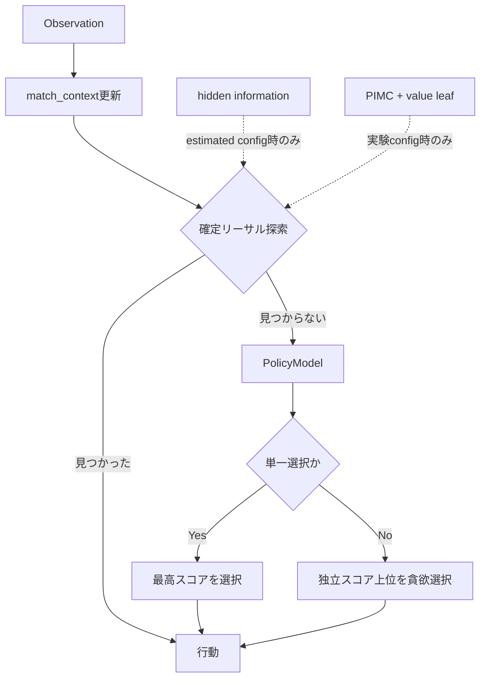

# AIアーキテクチャ方針 — Codex版 現状レビューと改善ロードマップ

作成: 2026-07-21  
状態: 現状診断・推奨案（既存方針を置き換える決定文書ではない）  
対象: `experiment/pimc-hidden-info-integration` 時点  
関連: [ai-architecture-strategy.md](./ai-architecture-strategy.md)

---

## 0. エグゼクティブサマリ

現在の方向性は概ね正しい。特に、PIMCを実装したあとに本番 `ml_policy` 上で効果が転移しないことを確認し、実戦ログの敗因分析から投資先をPolicyModelへ切り替えた判断は妥当である。

現時点の結論は次のとおり。

1. **現在の提出エージェントの中核はPolicyModelである。** 確定リーサル探索が先に動き、該当しない大半の局面をPolicyModelが判断する。
2. **PIMCとestimated hidden stateは技術的には動作するが、現行 `ml_policy` の勝率を改善する証拠がない。** 当面は本番投入・高度化を保留してよい。
3. **最新の技量集中実験では構成Cが有望。** 現行モデルとのミラー200試合で116勝84敗、勝率58.0%、Wilson 95% CI `[51.1%, 64.6%]`。構成Bは55.5%だがCIが0.5を含み未確定。
4. **構成Cはまだ即提出ではなく「有力な提出候補」。** 同一デッキのミラー評価なので、独立再現と非ミラーの対メタ評価を通す必要がある。
5. **次の大規模開発より、評価の外的妥当性を高める方が先。** 構成Cを確実な改善へ変換してから、ATTACK分業、複数選択、モデル容量、self-play、探索再開の順に進む。

推奨する直近の順序は以下。

```text
構成Cの独立ミラー再検証
        ↓
複数アーキタイプ相手の非ミラー評価
        ↓
提出候補化の判断
        ↓
ATTACK専用ハイブリッド
        ↓
player-group holdout・複数選択・系列特徴
        ↓
必要ならself-play / value / PIMCを再検討
```

---

## 1. 現在の意思決定経路

`AGENT_TYPE` は `ml_policy` で、標準configは `ml_lethal`。新しいPIMC設定や技量集中重みは、明示的に注入した実験時だけ使用される。



実装上の重要な点:

- 本番入口: [`ptcg_ai/core/agent.py`](../../../../ptcg_ai/core/agent.py)
- PolicyModel入口: [`ptcg_ai/ml_policy/ml_policy_agent.py`](../../../../ptcg_ai/ml_policy/ml_policy_agent.py)
- 現行標準config: [`configs/ml_lethal.json`](../../../../configs/ml_lethal.json)
- PIMC実験config: [`configs/ml_pimc.json`](../../../../configs/ml_pimc.json)
- 現行重み: [`ptcg_ai/learning/policy_weights.json`](../../../../ptcg_ai/learning/policy_weights.json)

したがって「hidden information・value・PIMCが存在する」ことと、「現在の提出判断に効いている」ことは分けて考える必要がある。現在の勝率を最も左右するのはPolicyModelである。

---

## 2. これまでに確定したこと

### 2.1 Rule-basedより模倣PolicyModelが強い

既存評価では、`ml_policy` は同一デッキのミラーでrule-basedに86.4%勝利した。オフラインTop-1一致率の差は約9ptだったが、逐次意思決定では小さな1手差が累積するため、対戦勝率では大差になったと解釈できる。

この結果から、手書きルールへ全面的に戻す理由はない。ルールベースは、正解を計算しやすい限定領域へ専門部品として残すのがよい。

### 2.2 PIMCはrule-based上では改善した

`rule_pimc` は `rule_lethal_estimated` に61%対39%で勝ち越した。

- 結果: [Stage2 head-to-head](../../../../results/2026-07-21_stage2_head_to_head.md)
- エラー: 0/100
- 実行コスト: Kaggleの1エージェント600秒予算に対して十分小さい

これはPIMC実装と評価インフラが機能する証拠である。ただし、弱いrule-based routerをPIMCが上書きした効果を含む。

### 2.3 PIMCは本番PolicyModel上では改善しなかった

本番構成に近い比較では次の結果だった。

| 比較 | 結果 | 判定 |
|---|---:|---|
| 現行 `ml_lethal` vs `ml_pimc` | 52% vs 48% | 有意差なし |
| 現行 `ml_lethal` vs `ml_lethal_estimated` | 55% vs 45% | 有意差なし |

詳細: [PIMC本番検証まとめ](../../../../results/2026-07-21_pimc_prod_validation_summary.md)

したがって、現在のPolicyModelへPIMCをbolt-onしても改善する根拠はない。PIMC高度化を次の本命にする前提は弱まった。

### 2.4 実戦の負けは接戦より大差が多い

自チーム363試合の負け201件を分類した結果:

| 負け分類 | 件数 | 割合 |
|---|---:|---:|
| サイドレース大差 | 139 | **69.2%** |
| 山札切れ | 52 | 25.9% |
| サイドレース接戦 | 10 | **5.0%** |

詳細: [loss taxonomy](../../../../results/2026-07-21_loss_taxonomy_breakdown.md)

終盤探索が救いやすい接戦負けが5%しかないため、PIMC/lethalの精度向上だけで大きく勝率を伸ばすのは難しい。試合全体を通した展開・テンポ・資源配分を担うPolicyModelを改善する方が筋がよい。

ただし「ブローアウト」は結果の形であり、原因そのものではない。手札事故、デッキ構築、相手の展開速度、攻撃対象、カード使用順など、複数の因果が混ざる。ブローアウト69.2%をそのまま「PolicyModelが69.2%悪い」と読んではならない。

---

## 3. 最新のPolicyModel技量集中実験

### 3.1 仮説

現行PolicyModelはAlakazamプレイヤー全体を緩い順位重みで模倣している。上位プレイヤーの判断へ勾配を集中させれば、一般的な展開判断が改善する可能性がある。

構成:

| 構成 | 学習データ方針 | 主なリスク |
|---|---|---|
| A | rank≤200のみ | 15人、上位2人で60.7%を占める |
| B | rank≤1000のみ | 純度は下がるが261人で多様 |
| C | 全データを保持し上位を強リウェイト | 上位への勾配集中はあるがデータ多様性を維持 |

詳細: [skill concentration構成](../../../../results/2026-07-21_skillconc_configs.md)

### 3.2 オフライン結果

共通のrank≤200 held-out 3,408件に対するTop-1一致率:

| モデル | 上位一致率 | 現行比 | 全pool一致率 | 現行比 |
|---|---:|---:|---:|---:|
| 現行 | 60.80% | — | 59.23% | — |
| A | 62.18% | +1.38pt | 56.36% | -2.87pt |
| B | 61.56% | +0.76pt | 58.56% | -0.67pt |
| C | **62.29%** | **+1.49pt** | 58.06% | -1.17pt |

詳細: [skill concentrationオフライン評価](../../../../results/2026-07-21_skillconc_offline.md)

3構成すべて上位判断への一致率が改善しており、技量集中というレバーの方向は正しい。ただし改善は0.8〜1.5ptであり、「44.6%から61%へ一気に到達する」規模ではない。

### 3.3 最新オンライン結果

現行 `ml_lethal` と同一 `deck.csv` を使い、候補重みだけを変更したミラーhead-to-head。先手後手は100試合ずつ。

| 候補 | 試合 | 候補勝利 | 候補勝率 | Wilson 95% CI | 判定 |
|---|---:|---:|---:|---:|---|
| B | 200 | 111 | 55.5% | `[48.6%, 62.2%]` | 未確定 |
| C | 200 | 116 | **58.0%** | **`[51.1%, 64.6%]`** | 有意な勝ち越し |

生結果:

- [構成B](../../../../../league/results/_diag_skillconc_configB.json)
- [構成C](../../../../../league/results/_diag_skillconc_configC.json)

構成Cは、現時点で最有力の提出候補である。一方、CI下端が51.1%と境界に近く、候補選定後の独立な確認試験をまだ通していない。結論は「改善の強いシグナルあり」であって「提出改善が確定」ではない。

---

## 4. 現状の主要課題

### 4.1 ミラー評価からKaggleフィールドへの外挿

ミラーhead-to-headはモデル差だけを測りやすいが、次を測れない。

- 他アーキタイプ相手の頑健性
- 相手デッキごとの弱点
- 相手のカード効果に対する一般化
- hidden information / opponent modelingの価値
- 実フィールドのアーキタイプ比率での加重勝率

構成Cが「現行モデルの癖をミラーで突くモデル」である可能性を除外する必要がある。

### 4.2 61%天井の交絡

上位Alakazamパイロットの勝率61%は、到達可能性を示す参考値として有用。ただし同一条件比較ではない。

現在の「同アーキタイプ」判定は、観測中にAlakazamとKadabraが現れたかであり、60枚の完全一致を要求しない。このため61%には以下が混ざる。

- デッキリスト差
- プレイヤー技量差
- マッチメイク差
- 取得時期・メタ差
- 上位順位と対戦相手分布の相関

よって61%はPolicyModel改善だけの期待値ではなく、デッキと環境を含む観測上限である。

### 4.3 episode splitによるプレイヤー漏洩

現在のtrain/val/test分割はepisode IDのmd5で決まる。同じプレイヤーの別episodeは複数splitに入る。

特にrank≤200データは上位2人が60.7%を占めるため、held-out精度には「未知プレイヤーへの一般化」だけでなく「学習済みプレイヤーの別試合を再現する能力」が強く含まれる。

必要な追加評価:

- `team_id` 単位GroupKFold
- leave-one-player-out / leave-top-two-players-out
- 時系列holdout
- デッキリストhashまたはカード構成距離別holdout

### 4.4 モデル容量と独立スコアリング

現在のモデルは概ね次の形。

```text
state_features + option_features + card_embedding
    → Linear(..., 32)
    → ReLU
    → Linear(32, 1)
```

各選択肢を独立にスコアリングするため、以下を直接表現しにくい。

- 選択肢同士の相互作用
- 2枚以上を選ぶ組み合わせ
- 行動順
- 同じターンに既に行った操作との関係
- 「AかBのどちらかを選べばよい」という等価手
- opponent archetypeに応じた方針変更

単純な隠れ層拡大だけでなく、入力表現と選択集合の扱いを改善する必要がある。

### 4.5 複数選択が未学習

`maxCount > 1` は学習対象外で、実戦では各候補を独立採点して上位を貪欲に選ぶ。

この方法では以下を扱えない。

- 同名カードを複数選ぶ冗長性
- 進化ラインの組み合わせ
- 捨て札コストと残したいカードの相互作用
- ベンチ配置の組み合わせ

まず実戦での発火回数と勝敗への寄与を計測し、頻度が十分なら専用モデルを作る価値がある。

### 4.6 ATTACKの役割分担が不完全

既存評価ではATTACKのTop-1一致率がPolicyModel 60.5%、rule-based 94.9%。現在のlethal探索は確定リーサルだけを補うため、非リーサル時の通常ワザ選択はPolicyModelに残る。

これは実測で明らかな専門化候補である。

### 4.7 ValueModelを探索へ使う前の再学習が必要

ValueModelはサイド差には反応するが、`self_deck_count` の摂動方向一致率が46%で、山札切れにほぼ反応しない。現在はshadow modeなので直接害はないが、PIMCの葉評価として使う場合は長期戦・山札切れを誤評価する可能性がある。

### 4.8 実験ブランチと再現性

現在のexperimentブランチには以下が混在している。

- hidden information配線
- match context分離
- PIMC
- config注入
- PolicyModel再学習
- 診断スクリプト
- 一時ログと結果

研究速度は高いが、提出候補・再利用可能インフラ・分析専用コードの境界が曖昧になっている。重みファイルについても、データsnapshot、学習コマンド、コードcommit、hashをひとまとまりで記録する必要がある。

---

## 5. 推奨ロードマップ

### Priority 0: 構成Cを提出可能な証拠へ変える

#### Step 0-1: 独立ミラー再検証

構成C選定後の新しい試合群で追加400〜800試合を実行する。

条件:

- 現行 vs Cだけを事前に固定
- 途中結果を見て停止条件を変えない
- 先手後手を半々
- エラー、先後別勝率、平均ターン、試合時間を記録
- native engine RNGはPython seedでは完全再現できないことを明記

判断:

- 独立試験でもCI下端が0.5を上回る: ミラー改善を再現
- 点推定55%以上だがCIが0.5を含む: サンプル追加または保留
- 50%付近へ戻る: 初回結果はノイズの可能性

#### Step 0-2: 非ミラー対メタ評価

代表的な相手デッキ5〜10種類を固定し、現行と構成Cを同じ相手プールへ当てる。

最低限の出力:

| 指標 | 用途 |
|---|---|
| 全体加重勝率 | フィールド想定の提出判断 |
| アーキタイプ別勝率 | 改善・悪化した相手の特定 |
| 最悪マッチアップ | 破滅的退行の検出 |
| 先手/後手別 | 手番依存の確認 |
| ブローアウト・山札切れ率 | 勝率変化の中身 |
| action category別差分 | 何が改善したかの説明 |

#### Step 0-3: 提出候補化

構成Cを提出候補にする条件:

- 独立ミラーで改善再現
- 非ミラー全体勝率が現行以上
- 主要マッチアップで大幅悪化なし
- エラー0または現行同等
- Kaggle推論時間内

ここまで通った後に、候補重みを正式な `policy_weights.json` へ反映する。

### Priority 1: 得意分野別ハイブリッド

単一モデルですべてを解かず、実測に基づいて分業する。

| 判断領域 | 推奨担当 |
|---|---|
| PLAY / ABILITY / 展開 | 構成C PolicyModel |
| 確定リーサル | `lethal_simple` |
| 通常ATTACK | rule-based attack評価または専用AttackModel |
| 複数選択 | 組み合わせ専用ロジック/モデル |
| 未知context・異常時 | safe fallback |

最初に試す価値が高いのは「非リーサルATTACKをrule-basedへ委譲する」A/B。既に94.9%対60.5%という強い事前証拠がある。

### Priority 2: 評価設計の強化

1. player-group holdout
2. 時系列holdout
3. exact deck / deck distanceで層別
4. select typeだけでなくOptionType・ターン帯・選択肢数別評価
5. 現行と候補が異なる手を選んだ局面だけを抽出
6. 差分局面をリプレイビューアでレビュー

Top-1一致率だけでは、複数の等価手や、教師自身のミスを扱えない。最終判断は必ず対戦勝率と組み合わせる。

### Priority 3: PolicyModelの表現力改善

軽い順にアブレーションする。

1. 隠れ層 `32 → 64 → 128`
2. 2層MLP
3. 上位プレイヤー寄与のplayer単位正規化
4. option集合のpooling特徴（候補内最大/平均/種類数）
5. 直前行動・ターン内使用済みフラグ
6. opponent archetype posterior
7. 複数選択の自己回帰/pointer型選択

一度に複数軸を変えず、構成Cを固定ベースラインとして各変更を比較する。

### Priority 4: 模倣の分布ずれ対策

行動模倣は専門家が到達した局面を学ぶが、AI自身が誤った後に到達する局面は学習データに少ない。このcovariate shiftが逐次ゲームで蓄積する。

候補:

- 自己対戦局面を収集し、現行/候補/探索の選択差を記録
- 勝利trajectoryを高重み化するadvantage-weighted imitation
- BC初期化後の限定的self-play fine-tuning
- opponent poolを保ったリーグ学習

ゼロからのAlphaZero型学習ではなく、現在の模倣モデルを初期値として使う。

### Priority 5: PIMC再開条件

次のどれかが満たされた場合だけ再投資する。

- 非ミラーでhidden informationの価値が確認された
- 改善PolicyModelをpriorとして使う探索に明確な発火域がある
- ValueModelを長期戦・山札切れ対応へ再学習した
- 接戦負けの割合が増え、終盤最適化の救済対象が増えた

再開時の技術課題:

- 全root actionを同じdeterminizationsで比較
- actionごとのサンプル数差による平均値バイアスを除去
- strategy fusion対策
- policy priorによる枝順序最適化
- search setup/value評価のキャッシュ
- 相手ターンを含む探索、またはISMCTSへの移行判断

---

## 6. デッキとAIの効果を分離する

現状の「上位Alakazamは61%」分析は、同じ主要進化ラインを使うデッキ群の比較であり、同一60枚比較ではない。

今後は次の二軸を分けて評価する。

```text
AI固定 × デッキ変更 → デッキ構築の効果
デッキ固定 × AI変更 → プレイ方策の効果
```

可能ならリプレイから推定した完全/準完全デッキをhash化し、現行 `deck.csv` とのカード枚数距離が小さい集団だけで上位プレイヤー勝率を再集計する。これにより「+16ptのうち何ptがpilotingで、何ptが構築か」をより正確に推定できる。

---

## 7. 実験・統合の運用改善

### 7.1 成果を3種類へ分離

1. **提出候補**: 本番動作へ必要な最小コード・重み・config
2. **再利用インフラ**: match context分離、config注入、league評価
3. **分析専用**: 診断スクリプト、生ログ、中間JSON

experimentブランチから有効部分をこの単位で `feature/*` へ切り出す。

### 7.2 各実験の必須メタデータ

- git commit SHA
- 学習データファイルのhash
- feature生成コマンド
- 学習コマンドとハイパーパラメータ
- 出力weightsのhash
- 対戦コマンド
- 試合数、先手後手、エラー、CI
- native RNGが完全再現不能である注意

### 7.3 結果文書を更新する

最新のB/Cオンライン結果は生JSONにはあるが、計画のStep4/Step5に対応するMarkdownまとめがまだ必要。

推奨ファイル:

- `results/2026-07-21_skillconc_headtohead.md`
- `results/2026-07-21_skillconc_summary.md`

構成Cを正式な候補にする前に、独立再検証と非ミラー評価も同じ文書系列へ追記する。

---

## 8. 現時点の判断表

| テーマ | 現在の判断 | 優先度 |
|---|---|---:|
| 構成C技量集中 | 有望。独立再現・非ミラー待ち | **最優先** |
| 構成B | 方向は良いが有意差なし | 比較対照 |
| PIMC本番投入 | 改善根拠なし | 保留 |
| hidden state単独投入 | 改善根拠なし | 保留 |
| ValueModel意思決定接続 | 山札切れ盲点あり | 再学習後 |
| ATTACK分業 | 強い事前証拠あり | 高 |
| 複数選択モデル | 未計測の弱点 | 発火頻度計測後 |
| モデル大型化 | 技量集中の次 | 中 |
| self-play RL | BC改善後の仕上げ | 低〜中 |
| デッキ変更 | AI効果と分離して評価 | 並行候補 |
| 実験ブランチ整理 | 再現性・共有のため必要 | 高 |

---

## 9. 最終提言

現在のプロジェクトで重要なのは、新しい高度なアルゴリズムを追加することより、**すでに出た構成Cの改善シグナルを、再現可能でフィールドへ外挿できる提出根拠へ変えること**である。

PIMC、hidden information、value、opponent modelingは無駄ではない。これらにより「何が効かないか」を実験で否定できる基盤ができた。一方で、現時点の勝率ボトルネックはPolicyModel側にあり、最新結果もその判断を支持している。

したがって次の一手は、構成Cの独立再検証と非ミラー評価。その後、ATTACK分業と評価split改善へ進む。PIMC/ISMCTS/self-playの大投資は、それらを完了してもなおPolicyModelが頭打ちになった時点で再評価するのが最も費用対効果が高い。
