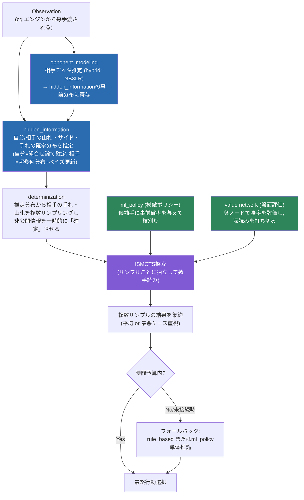
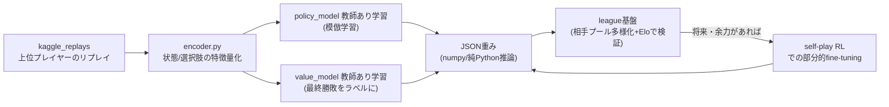

# AI アーキテクチャ方針（統計的機械学習サーベイ + 今後の推奨ロードマップ）

作成: 2026-07-21
状態: 検討メモ（決定ではなく、あくまで推奨案）
関連: [ml-agent-plan.md](./ml-agent-plan.md)（個人方針メモ、本文書はこれを実装状況に照らして更新・具体化したもの）

このドキュメントは2部構成。

- **第1部**: このプロジェクトで統計的機械学習が有効そうな理由を、山札推定・盤面評価などの具体テーマに沿って一つの文章としてまとめる。
- **第2部**: 今後どういう形のAIを作っていくかの推奨方針。どこで何を使うか・なぜそれを選ぶか・何を却下したか・図式。

---

## 現状の棚卸し（前提として）

文書を書く前提として、現在のリポジトリの実装状況を確認した。詳細な理由は各部で述べるが、まず結論だけ書くと、**推定系・評価系のモジュールは個別には動いているが、実際の意思決定にはほとんど繋がっていない。**

| モジュール | 実装レベル | 意思決定への接続 |
|---|---|---|
| `opponent_modeling`（相手デッキ推定） | 動作する。hybrid predictor、外部評価で高精度 | 未接続（`hidden_information/match_context.py` からの副作用呼び出しのみ） |
| `hidden_information`（自分/相手の山札・サイド・手札推定） | 動作する。自分側は組合せ論で確定、相手側は超幾何分布 | 未接続（探索に渡るのはダミースタブ `search_state_stub.py`） |
| `board_evaluation`（ルールベース特徴量） | 動作する | 実戦で使用中（`rule_based` 側） |
| value network（`learning/value_model.py`） | 学習済み、オフライン評価で test AUC 0.746 | 未接続（可視化ツールでのみ使用） |
| `search`（探索） | `lethal_simple.py`（自ターン限定リーサル探索）のみ実装 | `rule_based` と `ml_policy` 双方から使用 |
| `ml_policy`（模倣ポリシー、選択肢スコアリング） | 動作する。オフライン Top-1一致率 0.59、ミラー戦で rule_based に86.4%勝利 | `rule_based` とは独立した別エージェントとして単体稼働 |
| リーグ基盤（`league/`） | 2エージェントのA/B対戦CLIのみ | Eloや相手プール管理はまだ無い |

この状態は `ml-agent-plan.md` が最初に描いていたロードマップ（エンコーダ→バリュー→ポリシー→探索と結合→自己対戦）の1〜2段階目まで進んだところで、**本命である「探索との結合」に手が付いていない**、と要約できる。第2部の推奨方針はこのギャップを埋める順序を提案する。

---

# 第1部: 統計的機械学習が有効そうな理由

このゲームで機械学習・統計的手法が効きやすいのは、突き詰めると次の一点に集約される。**「非公開情報」自体が本質的に確率分布の推定問題であり、かつ「最終的な勝敗」という質の高い教師信号が大量のリプレイという形で既に手元にある**、という2つの条件が揃っているからだ。ルールベースの手書きロジックは「見えている情報から明示的なif文で判断する」ことしかできないが、見えていない情報（相手の手札、山札の並び、これから起きる勝敗）を扱う場面では、統計的な推定・学習に置き換えたほうが原理的に筋が良い。

まず山札・サイド・相手デッキの推定について。自分の山札とサイドは、60枚という有限母集団から公開済みゾーン（手札・トラッシュ・場）を引いた残りなので、これは機械学習というより**厳密な組合せ論・超幾何分布による統計的推論**で閉じる問題であり、実際 `hidden_information/own_hidden_state.py` は誤差ゼロで計算できている。一方、相手の山札・手札は「相手のデッキがそもそも何か」という一段上の不確実性があるため、超幾何分布だけでは足りず、相手デッキ推定（ナイーブベイズ→ロジスティック回帰→hybrid のブレンド）と組み合わせてベイズ的に更新する設計になっている。ここが機械学習の得意分野なのは、相手デッキ推定が「プレイされたカードの系列から所属クラスを当てる」という教師あり分類問題として綺麗に定式化でき、かつ対戦のたびに教師データ（実際にどのデッキだったか）が自然に手に入るためだ。相手のデッキが分かれば、そのデッキに採用されているカードの効果・数値をエンジンの静的データからあらかじめ全て知ることができる。これは「相手の見えているカードから経験的にデッキを推測する」人間の上位互換の情報処理であり、AI側の優位性が最も出やすい部分だと考える。

次に盤面評価について。ルールベースの評価関数（`board_evaluation/`）は人間が言語化できる基準（アタッカーの火力、エネルギー効率など）を明示的にスコア化するもので、これはこれで解釈性が高く土台として妥当だが、上限がある。手書きでは「サイド差3枚だがベンチ育成が遅れている」のような多変数の非線形な相互作用を、全ての組み合わせについて人手で調整しきるのは現実的でない。ここに教師あり学習（value network）を使う根拠は明快で、**リプレイの各局面には「そのゲームの最終的な勝敗」という完全な教師ラベルが既についている**。局面の特徴量から最終勝率を予測する回帰/分類問題として定式化すれば、モデルは人間が明示的に書き下していない相互作用を学習データから自動で拾える。実際、Step1で学習した value network はテストAUC 0.746（マッチアップ表ベースラインのAUC 0.566を明確に上回る）という実績が既に出ており、方向性の正しさは検証済みと言える。value network が効くもう一つの理由は、探索と組み合わせたときに「深く読みすぎず、途中で打ち切って評価する」ことができる点にある。ポケカは1ターンの中でも行動の組み合わせが多く、終局まで読み切る探索は非現実的なので、ある程度の深さで打ち切ってvalue networkに評価させる設計（後述）が計算コストと精度のバランスを取る上で重要になる。

模倣ポリシー（`ml_policy`、選択肢スコアリング）が有効なのは、このゲームの行動空間が「固定の行動カテゴリの中から選ぶ」のではなく「`obs.select.option` という可変長・可変個の選択肢群からいくつか選ぶ」という形をしているためだ。固定次元の分類問題として学習するのが難しいので、代わりに「各選択肢を特徴量化して個別にスコアリングし、スコア順に選ぶ」という設計（learning-to-rank に近い発想）を取っている。教師データは Kaggle 上位プレイヤーのリプレイで、これは「強いプレイヤーが実際にその局面でどの選択肢を選んだか」という直接的な模範データなので、模倣学習との相性が良い。オフラインでTop-1一致率0.59（ランダム0.28、rule_baseの一致0.50を上回る）、ミラー戦でrule_baseに86.4%の勝率という実績が出ており、これも方向性としては機能している。ただしワザ選択（ATTACK）だけはルールベースの方が精度が高い（94.9% vs 60.5%）という非対称性があり、これは模倣学習が「終盤のダメージ計算のような明示的に正解が計算できる場面」より「序盤〜中盤の展開判断のような暗黙知が支配する場面」で相対的に強いことを示していると解釈できる。この非対称性自体が、模倣学習とルールベース/探索を役割分担で組み合わせるべき根拠になっている。

以上をまとめると、統計的機械学習がこのプロジェクトで有効なのは、(1) 非公開情報の推定という統計学が本来得意とする問題がゲームの中核にあり、(2) Kaggle上位リプレイという質の高い教師データが既に大量にあり、(3) 「最終勝敗」という信頼できる長期報酬がラベルとして直接使え、(4) 行動空間が可変長のため学習to-rank的な設計と自然に噛み合う、という4つの条件が揃っているからだ。逆に言えば、これらの条件が薄い部分（例えば探索の木構造そのものや、1ターン内の行動順序の扱いのような「アルゴリズム的な設計判断」）は学習で解決するより明示的な工夫（マクロアクション化など、第2部で述べる）で対処すべき領域であり、機械学習を機械学習が向いていない場所にまで持ち込まないことも同じくらい重要だと考える。

---

# 第2部: 今後のアーキテクチャ方針（推奨案）

繰り返しになるが、**これは決定ではなく推奨案**。前提や優先順位が変われば当然見直してよい。

## 推奨する全体像（オンライン推論時）

オフライン（学習・検証）側は別の輪として次のように回す。

## 段階ごとの推奨（どこで何を使うか）

### Stage 1（最優先・新規MLモデル不要、配線だけ）

現状の最大の問題は「モデルの精度」ではなく「作ったものが繋がっていない」ことなので、まずここから着手するのが最も費用対効果が高い。

- `hidden_information` の実推定値を、`search_state_stub.py` のダミー（ランダムな基本エネルギー等で埋めている）の代わりに `search_begin()` へ渡す。`search_adapter.py` が入口として既に用意されている。
- value network（`learning/value_model.py`）を `lethal_simple.py` の非リーサル局面評価、あるいは `ml_policy` のATTACK判断（弱点が判明している箇所）の補強に使う。
- ここまでは教科書的には「既に学習済みのモデルを推論パイプラインに接続するだけ」の作業で、新しいアルゴリズム選定は不要。

### Stage 2（本命: ISMCTS + policy prior + value leaf評価）

`ml-agent-plan.md` が当初「一番勝率が伸びるところ」と書いていた部分で、この評価も妥当だと考える。

- **アルゴリズム**: ISMCTS（Information Set MCTS）/ Determinization（PIMC）。非公開情報を推定分布からサンプリングして一時的に完全情報化し、通常のMCTSを複数サンプルぶん回して平均を取る。出典: Cowling, Powley & Whitehouse, *Information Set Monte Carlo Tree Search*, IEEE TCIAIG (2012)。
- **なぜこれか**: ルールが完全に既知で正確にシミュレートできる本ゲームに素直に適合し、実装コストが比較的低く、時間予算に応じて反復回数を調整できるため Kaggle の持ち時間制約と相性が良い。
- **policy prior**: `ml_policy` を「単体エージェント」から「探索の候補手に事前確率を与えてPUCT的に枝刈りする部品」に転用する。AlphaGoのSLポリシーと同じ位置づけ（Silver et al., *AlphaGo*, Nature 2016）。ATTACK判断で模倣ポリシーが弱いという実測結果があるので、ATTACKの葉評価は探索+valueに、それ以外の展開判断はpolicy priorに重みを置く、といった役割分担がデータに裏付けられている。
- **value leaf評価**: 終局まで読み切らず、一定の深さで打ち切ってvalue networkに評価させる。AUC 0.746の実績があるので土台として十分使える。
- **1ターン内の行動順序問題への対処（マクロアクション化）**: エネルギー付与・進化・道具複数枚・サポート・ワザという複数行動の組み合わせをそのまま全順列展開すると木が爆発する。`lethal_simple.py` が `itertools.combinations` で選択肢の組み合わせを列挙しつつ `OptionType` の優先順位でソートしている設計は、この問題への簡易な対処に近い発想なので、ISMCTS側でもこれを踏襲・拡張し、可換な行動列（例: ベンチに2体出す順序）は正規化して同一ノード扱いにする。一般論としての出典: Sturtevant, Childs et al. *Transpositions and Move Groups in MCTS* (2008)、Sutton, Precup & Singh *Options* (1999)。

### Stage 3（余力があれば: 限定的な self-play fine-tuning）

- Stage 1-2 で土台ができた後、`league/` を「2エージェントのA/B対戦CLI」から「相手プールの多様性を保ったEloベースのリーグ」に拡張し、BC初期化済みのpolicy/valueをself-playで微調整する。
- `ml-agent-plan.md` の「ゼロからの自己対戦はやらない」という判断は今回の文献調査でも裏付けられる（AlphaStarのリーグ学習の知見: 対戦相手プールが単一だと自己に過適合し、人間相手やメタの変化に弱くなる。Vinyals et al., *AlphaStar*, Nature 2019）。フルスクラッチのself-play RLは計算コストと局所最適のリスクが大きいので、あくまでBC/探索で強くなった後の「仕上げ」として限定的に位置づける。
- Suphx（麻雀AI）の三段階設計（教師あり学習→self-play RL→oracle guiding）はフルスタックでは重すぎるが、「oracle guiding」（学習時だけ非公開情報を見せてvalue networkを学習し、推論時は推定値で代替する）という発想だけは、Stage 2のvalue network学習に軽量に取り込める余地がある。出典: Li et al., *Suphx*, MSRA, arXiv:2003.13590 (2020)。

## 却下・優先度を下げた選択肢とその理由

| アルゴリズム | 却下/後回しの理由 |
|---|---|
| **Deep CFR（フル版）** | ナッシュ均衡をオフラインで解く発想であり、Kaggleの1試合10分というオンライン推論制約と噛み合わない。相手のデッキ分布（メタ）が変化する環境では均衡戦略が過度に保守的になり、搾取力（弱い相手に大きく勝つ力）が下がりやすい。出典: Brown, Lerer, Gross & Sandholm, *Deep CFR*, ICML 2019。 |
| **Player of Games / Student of Games** | 「ルール既知+不完全情報」に理論的には最も正しく対応する枠組みで方向性は魅力的だが、public belief stateの管理やサブゲーム再解決の実装難度・計算コストが最上位クラス。研究チーム規模を前提とした手法で、小規模な個人開発には見合わない。出典: Schmid et al., arXiv:2112.03178 (2021)。 |
| **AlphaZero型フルself-play（ゼロから）** | value/policyをself-playだけで一から学習させるのは計算コストが支配的な上、`ml-agent-plan.md` で既に指摘されている「弱い初期方策のまま自己対戦すると変な癖を学習する」リスクが伴う。BCで初期化した後の限定的なfine-tuning（Stage 3）としてのみ採用する。 |
| **Suphx フルスタック（3段階すべて）** | 大規模なself-play基盤と繊細なハイパーパラメータ（oracle guidingの重み減衰スケジュールなど）が必要で、フル再現は重すぎる。ただし「oracle guiding」の発想だけはvalue network学習に部分採用する（上記Stage 3参照）。 |

逆に、**ISMCTS/Determinization・マクロアクション化・模倣学習をpriorとして使う設計**の3つは実装コストが比較的低く即効性が高いため、小規模な開発体制での現実的な優先候補と考える。

## 補足: 実装上の食い違いについて

調査の過程で、`core/agent.py` の `AGENT_TYPE` が現状 `"ml_policy"` になっている一方、`docs/plans/ml-value-network/step2-offline-evaluation.md` には「`AGENT_TYPE` は引き続き `rule_based` のまま」という記載が残っていることに気付いた（`core/agent.py` は git 未コミットの変更として存在する）。本文書はこの状態を批評する意図はなく、単に現状把握の一環として記録しておく。意図的な作業中の変更であれば無視してよい。
