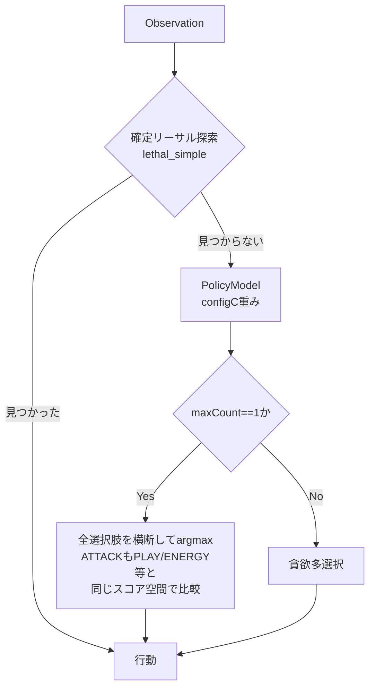

# 方針書: ATTACK専用ハイブリッド — 構成Cを固定ベースラインにしたrule-based ATTACK委譲

作成: 2026-07-21
状態: **完了・中止(2026-07-21)。600試合head-to-headで有意な勝率改善なし(51.8%、95% CI [47.8%, 55.8%])。
詳細は[実装計画](./attack-rulebased-hybrid-implementation-plan.md)と
[head-to-head結果](../../../results/2026-07-21_attack_hybrid_headtohead.md)を参照。**
対象ブランチ: `experiment/pimc-hidden-info-integration`
関連: [ai-architecture-strategy-codex.md](./ai-architecture-strategy-codex.md) §4.6 / Priority 1、
[policymodel-skill-concentration-implementation-plan.md](./policymodel-skill-concentration-implementation-plan.md)、
[skillconc head-to-head結果](../../../results/2026-07-21_skillconc_headtohead.md)

---

## 0. 目的（エグゼクティブサマリ）

現行 `ml_policy` は模倣ポリシー全体では rule-based に対しミラーで86.4%勝っているが、唯一 ATTACK（ワザ選択）だけは rule-based の方が明確に強い（Top-1一致率 94.9% vs 60.5%）。この非対称性は既に確定した事実であり、`ai-architecture-strategy-codex.md` の Priority 1 でも「最初に試す価値が高い」施策として挙げられている。

**本方針書の目的は、この施策を「構成Cを固定ベースラインにした一軸実験」として検証可能な形に設計すること。** 実装はまだ行わない。

1. **ベースラインは構成C（`policy_weights_configC.json`）に固定する。** 現行本番 `policy_weights.json` ではなく構成Cを「現状の一番強いもの」として扱う（ユーザー指示）。
2. **変更する軸はATTACK委譲のON/OFFのみ。** `ai-architecture-strategy-codex.md` Priority 3 の原則（「一度に複数軸を変えず、固定ベースラインとして比較する」）に従う。
3. **構成C自体はまだPriority 0（独立ミラー再検証・非ミラー評価）を完了していない。** この実験を構成Cの検証完了より先に走らせることは、ユーザーの判断として許容する。ただし後述§5でこのリスクを明記する。

---

## 1. 背景・根拠

- ATTACKのTop-1一致率: PolicyModel 60.5% vs rule-based 94.9%（[step2-offline-evaluation.md](../../../docs/plans/ml-value-network/step2-offline-evaluation.md) §7.3）。
- 解釈: rule-baseが強いのは「ダメージ計算+きぜつ判定」という正解が計算で求まる領域だから。模倣学習が苦手とする性質のズレであり、模様や展開判断の学習量を増やしても埋まりにくい非対称性。
- 既に同種のハイブリッド（確定リーサル探索を模倣ポリシーの前段に挟む）を実装・本番投入済み（[step2-lethal-hybrid.md](../../../docs/plans/ml-value-network/step2-lethal-hybrid.md)、submission 54860450）。ATTACK委譲はこのパターンの正当な拡張。
- 構成Cは技量集中実験のオンライン結果でミラー58.0%（Wilson 95% CI `[51.1%, 64.6%]`）と有意な勝ち越しを確認済み（[skillconc head-to-head](../../../results/2026-07-21_skillconc_headtohead.md)）。現時点で観測されている中では最強のPolicyModel重み。

---

## 2. 現状の意思決定経路（`ml_policy_agent.py` 実装ベース）

重要な点: `SelectType.MAIN`（`sample_submission/cg/api.py` 参照）は `PLAY, ATTACH, EVOLVE, ABILITY, DISCARD, RETREAT, ATTACK, END` を**同じ選択肢リストの中に混在**させて1回で選ばせる。つまり「ATTACKを選ぶかどうか」は独立した意思決定点ではなく、他カテゴリと同じスコア空間上の比較になっている（`sample_submission/ptcg_ai/rule_based/main_turn_parts/proposals.py` の `decide()` と同型）。

rule-based側は `main_turn_parts/priorities/attack.py` の `propose(obs) -> ActionProposal | None` が単独でATTACK候補を評価し（きぜつ判定 `_KO_BONUS` + 効果加点）、`proposals.decide()` が他カテゴリの提案とスコア＋カテゴリ基礎重みで比較して最終的に1手を選ぶ。

**この構造は「ATTACKだけを独立に切り出して委譲する」ことを単純にはできないことを意味する。** ATTACKを使うべきかどうかは、他の候補（展開・retreat・end_turnなど）との相対評価に依存する。この論点は§4で扱う。

---

## 3. 実験設計

### 3.1 固定するもの

- ベースライン重み: `kaggle_replays/policy_net/policy_weights_configC.json`（構成C）
- ベースconfig: `ml_lethal`（探索設定は両側共通、変えない）
- デッキ: 現行 `deck.csv`（フーディン）そのまま、ミラー対戦
- 評価インフラ: `league/_diag_skillconc_head_to_head.py` と同型のスクリプトを流用（`ml_policy_agent.agent(obs, config=...)` の `policy_weights_path` 注入点は既存のものをそのまま使い、新たに `attack_hybrid` のような config フラグを追加してON/OFF両側を用意する）

### 3.2 変える軸（1つだけ）

- `config["attack_hybrid"]["enabled"]`（仮称）: True/Falseのみ。重みは両側とも構成Cで固定。

### 3.3 比較

| 側 | 重み | ATTACK委譲 |
|---|---|---|
| baseline | configC | OFF（現行のまま） |
| candidate | configC | ON |

構成Cはまだ独立再検証中という前提を保ったまま、「configCという足場の上でATTACK委譲がさらに勝率を積み増すか」だけを見る。ATTACK委譲の効果が構成C自体の再検証結果に依存しないよう、両側とも同じconfigC重みを使うのがポイント。

### 3.4 判定基準（skillconc Step4と同型）

- 200試合以上、先手後手半々、Wilson 95% CI
- CI下限が0.5を上回れば「有意な勝ち越し」
- 点推定は上がるがCIが0.5を含む場合は追加試合または保留
- エラー0件を維持すること（rule_based側モジュールを新規importするため、契約違反(`_is_valid_action`)が出ないか特に注意）

---

## 4. 設計上の未確定事項（実装計画で確定させる）

方針書の段階では以下を「決めるべき論点」として明記するに留める。実装計画doc作成時にどれを採るか確定する。

### 4.1 委譲の粒度

候補は少なくとも3つある。

| 案 | 内容 | 長所 | 短所 |
|---|---|---|---|
| A. 全面委譲 | ATTACK型の選択肢が1つでも存在する場面では、`proposals.collect_proposals(obs)` + `decide()` 相当のロジックをそのまま呼び、その回の意思決定全体をrule-baseに譲る | 実装が最も単純。94.9%の実測環境をそのまま再現できる | PLAY/ABILITY等はml_policyの方が強い（rule_baseは19.7%/8.3%）ことが既知。ATTACK型選択肢が存在するだけでその回の展開判断まで失う可能性 |
| B. rule-baseの「攻撃すべき」判定をゲートにする | rule_baseの`attack.propose()`＋`proposals.decide()`を裏で走らせ、rule_baseが選んだカテゴリが実際に`attack`だった場合のみ、そのATTACKの選択肢インデックスを採用。それ以外はPolicyModelに委ねる | 「ATTACKを選ぶべき場面」だけを絞れる。展開判断はPolicyModelに残る | rule_baseの他カテゴリ評価(展開・retreat等)の精度もこの判定に混ざる。「ゲートの質」が新たな不確定要素になる |
| C. スコア差し替え | PolicyModelが選択肢を横断スコアリングする際、ATTACK型の選択肢だけスコアをrule_baseの`attack.propose()`由来の値に差し替え、非ATTACK型はPolicyModelのスコアのまま横断比較する | 既存の「横断argmax」構造を保ったまま、ATTACK単体の評価精度だけ入れ替えられる | 2つの異なるモデルのスコアスケールを揃える必要がある（PolicyModelはlogit的スコア、rule_baseはダメージ量+ボーナスの生値）。較正なしでは無意味な比較になるリスクが高い |

**現時点の見立て:** 案Cはスケール較正の追加検証が要り実装計画が重くなる。案Aは既知の弱点（PLAY/ABILITY）を巻き込みやすい。**案Bが最も筋が良さそうだが、「rule_baseの他カテゴリ判定を信用してATTACK/非ATTACKのゲートに使う」ことの妥当性を先にオフラインで確認する価値がある**（例: 学習データ上で「rule_baseがattackカテゴリを選んだ回」に絞ったときのATTACK一致率が94.9%からどれだけ変わるか）。実装計画docの最初のステップとして位置づける。

**決定(2026-07-21): 案Bで進める。** ただし境界の扱いについてユーザーに確認したところ、
「他の人の担当なので他のファイルを書き換えない形でできないか」との回答を得た。したがって
実装は **`rule_based/main_turn_parts` 配下のファイルを一切変更せず、既存の公開関数
(`attack.propose` / `proposals.collect_proposals` / `weights.CATEGORY_BASE_WEIGHT`)を
読み取り専用でimport・呼び出しするだけ** に限定する(`feedback_respect_ownership_boundaries`
memory に追記済み)。詳細は
[attack-rulebased-hybrid-implementation-plan.md](./attack-rulebased-hybrid-implementation-plan.md)。

### 4.2 モジュール分離原則との整合

`ml_policy_agent.py` の冒頭docstringには「`rule_based/` `action_selection/` は一切変更・呼び出しせず独立に完結させる」という設計原則が明記されている（`step2-design.md` §1）。ATTACK委譲はこの原則に対する初めての例外になる。

- `action_selection/selector.py`（rule_baseの最終フォールバックルーター）は引き続き呼ばない。
- `rule_based.main_turn_parts.priorities.attack`（および案Bなら`proposals`）という、副作用のない純関数モジュールだけを新規importする。
- 実装計画docで、この例外を明記し、docstringも合わせて更新する必要がある。

### 4.3 委譲のトリガー条件の技術的詳細

- `SelectType.MAIN` の `obs.select.option` に `OptionType.ATTACK` が1件以上含まれる場合のみ検討対象とする（`attack.py`の`propose()`と同じ判定）。
- `SelectType.ATTACK`（`cg/api.py` の別enum値、専用のATTACK選択コンテキスト）が実戦データに出現するかは未確認。出現する場合は同様に扱うか個別に決める。
- 確定リーサル探索が既に先に走っているため、ここで扱うのは非リーサルの通常ワザ選択のみ（現行の設計方針と一致）。

---

## 5. リスクと前提

- **構成Cの検証未完了リスク:** `ai-architecture-strategy-codex.md` Priority 0（独立ミラー再検証・非ミラー評価）がまだ完了していない状態でconfigCを固定ベースラインにする。もし後日configCの改善がミラー限定のノイズだったと判明した場合、本実験の「ATTACK委譲がconfigC比でさらに勝ち越すか」という結論自体は無効化されないが（両側とも同じconfigCなので相対比較は保たれる）、「configC+ATTACK委譲」を最終提出候補にする判断は、configC単体のPriority 0完了を待つ必要がある。
- **ミラー限定の外的妥当性:** 本実験もミラー対戦のみ。ATTACK委譲が非ミラー（多アーキタイプ）環境でも同様に効くかはPriority 0.2と同様、別途非ミラー評価が必要（Non-goalsとして本方針書では扱わない）。
- **rule_base新規importによる契約違反リスク:** `_is_valid_action` 検証は既存どおり通す設計にするが、rule_base側の`propose()`が返すインデックスがATTACK型の選択肢に限定される保証（`option.attackId is not None`等）を実装計画で確認する。

---

## 6. Non-goals（本方針書のスコープ外）

- ATTACK以外のカテゴリ（PLAY/ABILITY/ATTACH等）のハイブリッド化 — 既存evidenceはATTACKのみ強い非対称性を示しており、他カテゴリへの拡張は別軸。
- 非ミラー・複数アーキタイプ評価 — Priority 0.2と同じ範疇。ATTACK委譲がconfigC比で有意なら次のステップとして検討。
- `AGENT_TYPE`切り替え・Kaggle再提出 — 候補と証拠を出すところまで。提出判断はユーザー。
- 専用AttackModelの学習（案4.1のB/Cの発展形） — rule-baseロジックの流用で十分な効果が出るかをまず見る。

---

## 7. 次のステップ

1. 本方針書のレビュー・合意（特に§4.1の委譲粒度案B/Cどちらを採るか、または§4.1のオフライン事前検証を先にやるか）。
2. 合意後、`attack-rulebased-hybrid-implementation-plan.md` を別途作成し、関数シグネチャ・完了条件・変更ファイル一覧を確定する（[[feedback_design_vs_implementation_plan]]の方針どおり、設計docと実装計画docを分離する）。
3. 実装 → configC baseline vs configC+ATTACK委譲のミラーhead-to-head → 結果を `results/` に記録。
